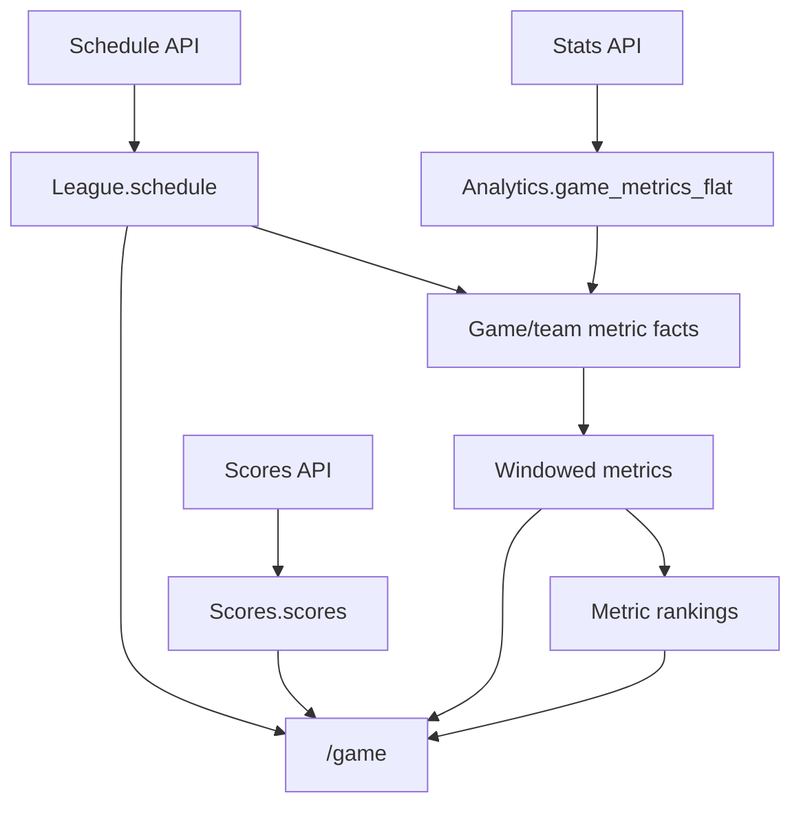

# GameLens Backend August Readiness Roadmap

**Last revised:** 2026-08-02
**Status:** Canonical working roadmap
**Code source of truth:** Current `meow/dev`
**Current packet:** Packet 4 — Activate through `app.py` (`IN PROGRESS — DEV REAL-DATA E2E PROVEN; PRODUCTION RESOURCE CONFIGURATION REQUIRED`)
**Deployment preflight:** Complete on `dev`; production activation has not occurred

This document replaces the earlier August plan and implementation-map drafts. It is the single practical roadmap for backend readiness.

The standard is intentionally modest:

> Make the 2026 data path dependable, test each change locally, and preserve the claim-learning work already completed.

GameLens is not being redesigned. Existing metric builders, `/game` logic, Levels 1–4, Claim Health, and historical QA results should be reused.

---

## 1. What August readiness means

The August must-have is:

```text
Valid scheduled NFL data
→ dependable source tables
→ Facts
→ Windowed Metrics
→ Rankings
→ useful pregame-safe /game response
```

Levels 1–4 are the next learning track. They are important, but they do not need to become scheduled production jobs before `/game` is ready.

### Source and runtime map



Scheduled source ingestion currently executes linearly:

```text
Schedule → Stats → Scores
```

Schedule establishes the shared game identity. Stats and Scores then attach different source facts to those scheduled games.

Required metric build order:

```text
Analytics.game_team_metric_facts_{season}
→ Analytics.team_metrics_windowed_{season}
→ Analytics.team_metric_rankings_{season}
```

### Claim-learning map

```text
Pregame-safe /game analysis
→ Level 1 claim extraction
→ final box score and completed-game Facts
→ Level 2 postgame validation
→ Level 3 feature enrichment
→ Claim Health
→ Level 4 calibration review when the sample is large enough
```

### Product-usage map

```text
User selects a game
→ frontend navigates to the matchup
→ GET /game/<game_id>
→ response is displayed
```

A user selection, a saved game-level outcome, and a claim-training row are different records.

User interest may later help prioritize teams, games, and explanations. It is not evidence that a football claim was correct and should not raise model confidence.

---

## 2. Current truths

These are the working assumptions this roadmap protects.

| Area                     | Current behavior                                                                                                                                                                                       | Roadmap decision                                                                                                         |
| ------------------------ | ------------------------------------------------------------------------------------------------------------------------------------------------------------------------------------------------------ | ------------------------------------------------------------------------------------------------------------------------ |
| Schedule                 | Schedule ingestion supplies `League.schedule`, including game identity, status, season, teams, and dates.                                                                                              | Preserve it as the shared game identity source.                                                                          |
| Stats                    | The Stats loader appends parsed rows to `Analytics.game_metrics_flat` and updates the box-score-loaded marker. Its return value represents successfully processed **games**, not inserted metric rows. | Validate before insertion and name the count truthfully.                                                                 |
| Stats retry behavior     | A marker failure can leave inserted metric rows eligible for another retry.                                                                                                                            | Prevent a retry from blindly appending the same game again.                                                              |
| Facts duplicate handling | The Facts builder de-duplicates the grain `season + game + team + metric`.                                                                                                                             | Useful protection, but not a substitute for safe ingestion because corrected duplicate values have no reliable ordering. |
| Scores                   | The Scores loader can construct two rows even when its home/away line-score objects are empty.                                                                                                         | Validate meaningful score content; `len(rows) == 2` is insufficient.                                                     |
| `/game` final score      | `/game` reads final-score data directly from `Scores.scores`.                                                                                                                                          | Scores safety belongs in the August source track.                                                                        |
| Targeted runs            | `app.py` can pass `load_date` through the configured calls, but the loader signatures are not consistently aligned.                                                                                    | Normalize this small interface while each loader is already being edited.                                                |
| Scheduler errors         | The current scheduler catches individual API errors and can still return a success response.                                                                                                           | Return a truthful success, no-op, partial failure, or failure.                                                           |
| Legacy aggregation       | `app.py` still calls the annual 2025 aggregate after Stats reports activity.                                                                                                                           | Replace only this hook after the new metric conductor is tested.                                                         |
| Container runtime         | Commit `2d95b4e` changed the Docker image from Python 3.9 to Python 3.11, matching `runtime.txt`; the isolated one-file commit is present on `dev`.                                                   | Treat Python 3.11 as the deployment runtime and verify the container before activation.                                  |
| Deployment trigger        | The external `dev` Cloud Build trigger is disabled; the enabled production trigger matches `^main$`.                                                                                                  | `dev` work must remain non-deploying; production activation occurs only through the controlled `main` path.              |
| Request deadlines         | Cloud Run currently permits 300 seconds; the enabled 8:00 a.m. Eastern Scheduler job permits 180 seconds and has no automatic retries (`retryCount` absent/default `0`).                              | Align both request deadlines to 900 seconds during controlled activation; keep automatic retries disabled initially.     |
| Facts builder            | `run_build_game_team_metric_facts()` already builds, validates, dry-runs, and writes the season table.                                                                                                 | Reuse it.                                                                                                                |
| Windowed builder         | `run_build_windowed_metrics()` already builds, validates, dry-runs, and writes the season table.                                                                                                       | Reuse it.                                                                                                                |
| Rankings builder         | `run_build_team_metric_rankings()` builds, validates, dry-runs, and writes `team_metric_rankings_{season}`.                                                                                            | Reuse it.                                                                                                                |
| Metric conductor         | `run_gamelens_metric_pipeline()` calls Facts → Windowed Metrics → Rankings for one explicit season and reports stage status/counts.                                                                    | Packet 2 is complete and remains inert until `app.py` calls it.                                                          |
| `/game` pregame safety   | Team metrics and rankings are selected strictly before the target game date.                                                                                                                           | Preserve this rule.                                                                                                      |
| Level 2                  | Validation uses completed-game Facts and merges by `run_id + claim_key`.                                                                                                                               | Reuse it; it is already broadly retry-friendly.                                                                          |
| Claim Health             | Admin reads claim-training examples for a selected `run_id`.                                                                                                                                           | Keep Claim Health in the learning path, separate from click tracking.                                                    |
| Final-game GET           | A final `/game/<game_id>` request may save a game-level outcome and trust details.                                                                                                                     | Do not confuse this side effect with Level 1 or user-event logging.                                                      |

### Runtime safeguards versus unit tests

Packets 1A–1C created both production safeguards and a focused regression suite. They are related, but they do not execute in the same place.

```text
Production API cycle:
Scheduler or manual /test ingestion trigger
→ Schedule
→ Stats [Packet 1A validation + Packet 1B acceptance/retry safety]
→ Scores [Packet 1C validation/retry safety]

Development verification:
python -m unittest discover -s tests/api_calls -p "test_*.py" -v
→ 31 focused Packet 1A/1B/1C tests
```

When the API cycle runs, the validator and retry-safe loader behavior run automatically inside Stats and Scores. The 31 unit-test cases do **not** run as a post-ETL production stage. The current `app.py` and `cloudbuild.yaml` contain no unit-test invocation, and the route named `/test` is a manual ingestion trigger rather than the Python test runner.

If automatic regression testing is wanted on future pushes, add an explicit CI or Cloud Build test step. Keep that separate from the scheduled ingestion request so production ETL does not spend time running its own development test harness.

---

## 3. The 80% scope decision

### Build now

* A pure box-score validator with focused tests
* Stats acceptance, marker, and retry safety
* Score validation and game-scoped retry safety
* One small Facts → Windowed → Rankings conductor
* A deliberate 2026 schema/build/runtime smoke test
* Final activation through current `app.py`

### Build after the August path is stable

* Game-scoped cumulative Level 1 production writes
* Levels 2–3 learning orchestration
* Claim Health pointed at the production learning run

### Do not build yet

* A new `ready/degraded/blocked` readiness subsystem
* A generalized multi-season scheduler
* A pipeline-run ledger table
* Mandatory immutable pregame snapshot storage
* Automatic daily Level 4 policy changes
* User-click analytics
* A `/game` SQL view or table-valued function
* A redesign of final-game model-outcome storage
* Broad refactors, renames, or formatting cleanup

For August, one explicit configured active season (`2026`) is acceptable. Historical or multi-season backfills can call the builders manually with an explicit season. Dynamic season discovery can wait until it solves a real problem.

---

## 4. Safety contract

1. Start every implementation packet from current `meow/dev`.
2. Patch `app.py` last and preserve all current routes and authentication behavior.
3. Reject incomplete source payloads before marking a game loaded.
4. Do not rely on downstream de-duplication to make source retries safe.
5. Rebuild the three metric tables only after accepted Stats data exists.
6. Do not make Levels 1–4 prerequisites for `/game`.
7. Never reuse a historical QA `run_id` for production learning writes.
8. Never replace an entire cumulative production Level 1 run to update one game.
9. Keep Level 4 focused on claim-language support, not winner confidence.
10. Do not automatically apply Level 4 recommendations to runtime language.
11. Avoid a “readiness” test that silently calls final-game `get_game_details()` and writes model outcomes.
12. Stop after each locally proven, meaningful commit.

The season tables are intentionally rebuilt in full by the existing builders. That is acceptable after source validation. Claim-training history is different: production reruns must be game-scoped.

---

## 5. Code-change working agreement

When we implement a packet:

* If one Python function changes, provide the complete replacement function.
* If several tightly coupled functions change, provide the complete file.
* Identify the filename and exact function being replaced.
* Include focused tests with the behavior change.
* Do not mix cleanup with the requested behavior.
* Christian applies the change locally, runs it, examines the result, and commits before the next packet.
* Each commit should make one new behavior true.

This roadmap specifies behavior and test boundaries. Exact code is chosen only after reading the full current function on `dev`.

---

# Track A — August must-have

## Packet 0 — Baseline and branch

**Status:** `COMPLETE`

**Evidence:** Work began from confirmed branch `dev` at baseline commit `77690e3`; the branch and relevant source files were inspected before Packet 1A.

**Goal:** Know the starting point before changing behavior.

Before Packet 1:

* update or compare the local branch with `meow/dev`;
* record the current commit;
* run the closest existing ingestion tests;
* confirm the current Stats, Scores, config, rankings, and `app.py` function signatures;
* create a focused working branch.

No production or BigQuery change occurs.

---

## Packet 1 — Safe source ingestion

### Packet 1A — Pure Stats box-score validator

**Status:** `COMPLETE`

**Evidence:** Commit `b95adbc` (`Add NFL box score validation gate`); all 11 focused validator tests passed. The validator remains pure and is not imported by production ingestion.

**Goal:** Decide whether a Tank01 Stats response is safe to parse and load.

**Create:**

```text
api_calls/api_utils/validate_nfl_boxscore.py
tests/api_calls/test_validate_nfl_boxscore.py
```

The validator should be pure: payload in, structured acceptance/rejection result out. It should not call Tank01, BigQuery, or the scheduler.

**Test at least:**

* valid final game with both teams and meaningful stats;
* non-final game;
* final status with an empty or skeleton body;
* only one team represented;
* missing game or team identity;
* malformed stat content;
* legitimate zero-valued statistics.

**Behavior impact:** None. Production does not import it yet.

**Done when:**

```text
payload
→ accepted
or
→ rejected with a useful reason
```

**Commit:**

```text
Add NFL boxscore payload validator and tests
```

### Packet 1B — Stats acceptance and retry safety

**Status:** `COMPLETE`

**Evidence:** Packet 1B implementation commit `c7e9e98`; the combined Packet 1A/1B focused suite ran 19 tests successfully, and the validator, Stats loader, and both focused test files compiled successfully. Commit `b4ff2fa` then merged the current `main` application baseline into `dev` while preserving the Packet 1A/1B files unchanged. The merge was pushed, and local `dev` and `origin/dev` were confirmed synchronized at `0 0`.

**Goal:** Publish only complete Stats data and keep retries from creating ambiguous duplicates.

**Update:**

```text
api_calls/api_call_nfl_stats.py
```

**Required sequence:**

```text
fetch response
→ validate
→ parse
→ confirm meaningful rows for both teams
→ insert or safely reconcile this game
→ confirm stored data
→ mark box score loaded
→ count the game as processed
```

**Required behavior:**

* A rejected response inserts nothing and leaves the game retryable.
* A marker is never written before valid Stats rows are confirmed.
* A marker-write failure is not counted as full success.
* A retry checks/reconciles existing rows for that game instead of blindly appending another copy.
* Existing complete rows plus a missing marker can be repaired without duplicating the game.
* The returned integer continues to mean processed games unless implementation proves a small result object is necessary.
* Variable names and log messages say `games`, not `rows`.
* The loader accepts the scheduler's optional `load_date` contract consistently, even if the parameter only influences eligibility indirectly.

The exact retry implementation may use a game-scoped existence/quality check, merge, or game-scoped replacement. Choose the smallest approach that fits the current loader.

**Local tests:**

1. Invalid response → no insert and no marker.
2. Valid response → insert confirmed before marker.
3. Insert failure → no marker and no success count.
4. Marker failure → run reports failure/incomplete.
5. Retry with complete existing rows → no duplicate insert.
6. Rejected game remains eligible for a later retry.

**Behavior impact:** Scheduled Stats acceptance changes.

**Commit:**

```text
Gate NFL stats loading and make retries safe
```

### Packet 1C — Score validation and retry safety

**Status:** `COMPLETE`

**Evidence:** Implementation commit `67e2212` (`Validate and safely retry NFL score loads`). The combined Packet 1A/1B/1C focused suite ran 31 tests successfully, and the Stats/Scores loaders plus both focused loader test files compiled successfully. The live `Scores.scores` and `Scores.score_status` schemas were inspected before implementation; Packet 1C preserves the existing 13-column score-row contract and two-column status contract.

**Goal:** Prevent empty final-score rows and repeated game rows from entering `Scores.scores`.

**Update:**

```text
api_calls/api_call_nfl_scores.py
```

A small pure validation function can live in this file unless the current code shows genuine reuse elsewhere. Do not create a generalized validation framework.

**Required behavior:**

* Require a final game and meaningful home/away score content.
* Require both team types and the game identity.
* Do not treat two constructed dictionaries as proof of valid source data.
* Reject empty `lineScore` objects.
* Make the two game rows safe to retry through a game-scoped merge, replacement, or verified no-op.
* Align the optional `load_date` signature with the scheduler.

**Local tests:**

1. Empty home/away line scores → no write.
2. One missing team → no write.
3. Valid final score → exactly one home and one away row.
4. Same game retried → still exactly one valid row per team.
5. Valid correction → the stored game can be repaired without affecting other games.

**Behavior impact:** Scheduled score acceptance changes.

**Commit:**

```text
Validate and safely retry NFL score loads
```

---

## Packet 2 — Metric pipeline conductor

**Status:** `COMPLETE`

**Evidence:** Implementation commit `e054ee0` (`Add GameLens metric pipeline conductor`); naming clarification commit `4c3e919` (`Clarify GameLens metric conductor naming`). The final files are:

```text
services/gamelens_metric_pipeline_conductor.py
tests/services/test_gamelens_metric_pipeline_conductor.py
```

All seven focused tests passed locally:

```bash
python -m unittest discover -s tests/services -p "test_gamelens_metric_pipeline_conductor.py" -v
```

The credentialed historical BigQuery dry run also succeeded:

```bash
python -c "from services.gamelens_metric_pipeline_conductor import run_gamelens_metric_pipeline; print(run_gamelens_metric_pipeline(season='2025', write=False))"
```

Recorded result:

```text
overall status: success
failed stage: None
Facts: 36,532 rows
Windowed Metrics: 138,532 rows
Rankings: 426,086 rows
```

Expected warnings were observed and handled without failure: 5,328 rows across eight unregistered metrics were excluded, and 220 duplicate Facts rows were deduplicated with `keep="last"`. The newly calculated Facts count matched the stored Facts count of 36,532.

**Goal:** Call the existing season builders in the only valid order.

**Implemented order:**

```text
Facts
→ Windowed Metrics
→ Rankings
```

The conductor:

* requires one explicit nonblank season;
* reuses `run_build_game_team_metric_facts()`, `run_build_windowed_metrics()`, and `run_build_team_metric_rankings()`;
* passes `recreate_table=False` to Rankings;
* does not copy or transform builder SQL, formulas, windows, rankings, or `lens_tags`;
* stops when a stage raises or returns an empty/non-DataFrame result;
* marks downstream uncalled stages as skipped;
* returns a plain summary with season, overall status, failed stage, stage statuses, and row counts;
* forwards `write=False` to every builder.

**Dry-run boundary:** With `write=False`, each builder calculates from its currently stored source table. Newly calculated upstream DataFrames are not passed downstream in memory. No BigQuery table is created, replaced, appended to, recreated, or wiped, though normal query costs can occur.

**Behavior impact:** None. `app.py` does not import or call the conductor, so Packet 2 does not create or activate the daily pipeline.

---

## Packet 3 — 2026 operational checkpoint

**Status:** `COMPLETE — PRESEASON/ZERO-DATA READINESS`

**Evidence date:** 2026-07-30

**Goal:** Prove the existing metric system can support 2026 before scheduling it.

Packet 3 was completed as a deliberate local/BigQuery checkpoint without changing application code, source ingestion, metric formulas, windows, rankings, `/game` behavior, or Levels 1–4.

### Schedule bootstrap and retry evidence

The season bootstrap loaded the complete 2026 schedule into `League.schedule`:

```text
dates checked: 243
failed dates: 0
season games found: 322
existing games skipped: 1
games inserted: 321
```

The immediate `write=False` rerun proved duplicate protection:

```text
season games found: 322
existing games skipped: 322
games to insert: 0
games inserted: 0
```

### Schema and table evidence

The current code-defined schemas matched the live 2025 tables exactly:

```text
Facts: 39 columns
Windowed Metrics: 33 columns
Rankings: 39 columns
lens_tags: STRING/REPEATED in all three
```

The following empty 2026 shells were then created with guarded create-only logic:

```text
Analytics.game_team_metric_facts_2026
Analytics.team_metrics_windowed_2026
Analytics.team_metric_rankings_2026
```

All three carried the expected `app=gamelens`, `domain=nfl`, and `managed_by=python` labels. A post-creation read confirmed zero rows and full schema equality with 2025. Historical tables were not deleted, replaced, or rebuilt.

### Zero-data conductor evidence

The conductor was run deliberately with:

```python
run_gamelens_metric_pipeline(season="2026", write=False)
```

Because no completed 2026 game Stats existed, Facts loaded zero source rows and raised `ValueError: No source rows found for season=2026`. The conductor reported:

```text
overall status: failed
failed stage: facts
Facts: failed
Windowed Metrics: skipped
Rankings: skipped
```

This is the expected fail-closed early-season result, not evidence of damaged tables. A follow-up metadata read confirmed all three 2026 metric tables still contained zero rows.

### `/game` degraded-mode evidence

A read-only service-layer smoke test used scheduled game `20260806_CAR@ARI`:

```text
header resolved: true
response season: 2026
final score: null
game profile rows: 0
team comparison rows: 0
core-area rows: 0
ranking available: false — no_ranking_rows_found
matchup breakdown available: false — ranking_context_unavailable
```

The response builder returned safely without manufacturing pregame history or changing matchup logic. No `lens_tags` fields existed because no metric rows existed; therefore `lens_tags_non_array_count: 0` proves no malformed value was emitted, but it does not yet prove populated 2026 tag arrays.

### Deferred real-data proof

After the first 2026 games finish and accepted Stats/Scores exist, perform this explicit follow-up:

```text
Stats
→ Facts
→ Windowed Metrics
→ Rankings
→ /game populated-row and lens_tags-array verification
→ Levels 1–4 real-data compatibility proof
```

Record source/output counts, representative strong/supporting/watch metric samples, populated `lens_tags` arrays, and the downstream season/run behavior. The current code inspection found the query/service and Levels 1–4 paths season-aware; no Level 1–4 formula, historical `run_id`, or QA table was changed. This deferred populated-data proof does not invalidate Packet 3's completed preseason checkpoint.

**Behavior impact:** The 2026 schedule and three empty metric-table shells now exist. No application code or scheduled workflow changed.

**Commit:** None for implementation; Packet 3 used deliberate credentialed runtime operations and this documentation checkpoint.
---

## Packet 4 — Activate through `app.py`

**Status:** `IN PROGRESS — DEV REAL-DATA E2E PROVEN; PRODUCTION RESOURCE CONFIGURATION REQUIRED`

**Goal:** Replace the legacy annual aggregate hook with the tested metric conductor.

### R6 real-data controlled replay — PASS with resource follow-up

**Evidence date:** 2026-08-02  
**Detailed runbook:** `documentation/August/GameLens_Packet_4_R6_Real_Data_Replay_and_Recovery_20260802.md`

R6 exercised the current Packet 4 path against live Stats and Scores APIs for controlled replay game `20250918_MIA@BUF`, with every destination pinned to `League_dev`, `Scores_dev`, and `Analytics_dev`.

The real flow proved:

```text
live Stats API → 132 accepted dev rows
live Scores API → 2 accepted dev rows
→ Facts: 36,538 rows
→ Windowed Metrics: 138,532 rows
→ Rankings: 426,965 rows
```

Both source status records were written and both game-specific backlogs drained to zero. Production data was not targeted or changed.

The initial web request reached revision `nfl-games-app-dev-00066-hw9` but returned HTTP 503 after Cloud Run exceeded its `512Mi` limit with 519 MiB used. Facts and Windowed Metrics had already committed; Rankings had not started. The original POST was deliberately not repeated.

The dev service was increased to `1Gi` and verified healthy at revision `nfl-games-app-dev-00067-w8r`, with all nine isolation variables and the dedicated replay service account preserved. Only the missing Rankings stage was then executed once through job `gamelens-r6-rankings-recovery` at `4Gi`, zero retries, and a 30-minute timeout. Execution `gamelens-r6-rankings-recovery-6nsns` completed successfully in 3m29.35s and increased Rankings from 426,086 to 426,965 rows.

The schedule row's `boxscore_loaded` and `score_loaded` columns remained false. Current code does not update those columns; the Stats and Scores backlog views use their status tables as the authoritative completion records. Because both status rows existed and both backlogs were zero, no manual flag repair was made. Consolidating or explicitly synchronizing the duplicate completion signals is recorded as non-blocking technical debt.

**Packet 4 interpretation:** The application logic and real data flow are proven in isolated dev. Packet 4 is not yet fully production-ready because `512Mi` is definitively insufficient, the manual `1Gi` dev change is not durable deployment configuration, and the complete chain was not proven as one uninterrupted `1Gi` request. Before merge/activation, persist the chosen production memory and decide whether Rankings remains inside the request conductor or runs as a dedicated Cloud Run job.

### Completed deployment preflight

The following checks were completed on 2026-07-30 before Packet 4 implementation:

```text
Python image: 3.9 → 3.11
Runtime commit: 2d95b4e — Align Cloud Run image with Python 3.11
Commit scope: Dockerfile only
GitHub proof: dev is exactly one Dockerfile commit ahead of documentation checkpoint d76dbea
Dev Cloud Build trigger: disabled
Production Cloud Build trigger: enabled for ^main$ only
Cloud Run request timeout: 300 seconds
Production Scheduler deadline: 180 seconds
Production Scheduler: daily 8:00 a.m. America/New_York; no automatic retries
```

The Python 3.11 commit is pushed to `dev`, but the disabled `dev` trigger means it has not deployed production. No Cloud Run or Scheduler setting was changed during preflight.

**Primary code seam — update last:**

```text
app.py from current meow/dev
```

**Deployment configuration seam:**

```text
cloudbuild.yaml — persist a 900-second Cloud Run request timeout
Get-NFL-Schedule — set attempt deadline to 900 seconds during controlled activation
```

The Cloud Run and Scheduler settings must agree before the complete scheduled chain is enabled. Keep Scheduler automatic retries at zero until the local/container rehearsal and first controlled run succeed.

**Required behavior:**

```text
run Schedule → Stats → Scores
→ no accepted Stats games: successful no-op for metric builds
→ accepted Stats games: run Facts → Windowed → Rankings for configured 2026
→ return truthful stage results
```

Keep this practical:

* Use one explicit configured active season for August.
* Preserve every blueprint, route, auth check, and scheduler entry point on current `dev`.
* Remove only the old `aggregate_nfl_metrics_2025` hook.
* Rename Stats variables/logs from inserted rows to processed games.
* Do not report full success when an ingestion or metric stage failed.
* A Scores failure should be visible because `/game` final-score data depends on `Scores.scores`; do not silently claim total pipeline success.
* Keep the existing targeted `load_date` path working after Packet 1 normalizes loader signatures.

**Local tests:**

1. No accepted Stats games → metric conductor not called and response reports a successful no-op.
2. Accepted Stats games → conductor called once for 2026.
3. Stats failure → downstream metric build not reported as successful.
4. Scores failure → overall result is partial failure or failure, not full success.
5. Metric-stage failure → failed stage named truthfully.
6. Targeted `load_date` reaches Schedule, Stats, and Scores consistently.
7. `/health`, `/games`, `/game`, Admin, user-management, and all other current routes remain registered.
8. Existing auth behavior remains unchanged.
9. The Python 3.11 container builds, starts, and serves the preserved routes.
10. Deployment configuration requests a 900-second Cloud Run timeout without altering the `main`-only trigger boundary.

### Controlled activation checks

Before merging or deploying Packet 4:

1. Run the focused Packet 4 tests locally.
2. Build and boot the Python 3.11 Docker image locally.
3. Confirm the `dev` trigger remains disabled and the production trigger remains `main`-only.
4. Confirm `cloudbuild.yaml` deploys Cloud Run with a 900-second request timeout.
5. Change `Get-NFL-Schedule` to a 900-second attempt deadline at activation, not during development.
6. Keep automatic Scheduler retries disabled for the first controlled run.
7. Verify the deployed revision, one no-op/controlled request, route health, and returned stage summary before relying on the next daily schedule.

Raising a timeout limit does not reserve or bill the full 15 minutes; cost follows actual Cloud Run execution and BigQuery work. The longer limits simply prevent a healthy run from being cut off at the current three- or five-minute boundaries.

**Behavior impact:** The `app.py` activation commit and matching deployment settings change production behavior only when they reach the enabled `main` deployment path. The existing Python 3.11 commit on `dev` is preflight only and has not deployed production.

**Commit:**

```text
Activate GameLens metric rebuilds after accepted stats
```

---

## Packet 5 — Preseason rehearsal and replay proof

**Goal:** Prove the scheduled path can run, no-op, fail visibly, and replay safely.

Run at least:

* no eligible games;
* incomplete Stats response;
* valid completed game;
* duplicate/retry of the same completed game;
* score correction;
* one forced builder failure;
* targeted `load_date` run.

Record:

* accepted/rejected game counts and reasons;
* output row counts;
* which stages ran, skipped, or failed;
* whether the retry duplicated data;
* whether `/game` remained usable;
* whether existing routes and `/game` logic remain intact;
* whether historical QA tables were unchanged.

**Done when:**

```text
The August path can distinguish:
no new usable data
vs
accepted new data and successful rebuild
vs
partial failure
vs
failure
```

---

# Track B — claim-learning productionization

This track begins only after the August `/game` path is dependable.

## Level 1 — Production claim generation

**Current truth:** Level 1 exists and generates pregame-safe claim examples. The missing work is cumulative production writing and orchestration.

Create a distinct production `run_id`, for example:

```text
production_daily_2026_claim_training
```

Requirements:

* Generate or load pregame-safe `/game` payloads for the selected final games.
* Preserve historical 2023–2025 QA runs.
* Merge one game's claims by stable grain such as `run_id + claim_key`, or delete/reinsert only that game within the production `run_id`.
* Never use whole-run replacement to update one game in a cumulative production run.
* Persist the production row before Level 2.

## Level 2 — Completed-game validation

**Current truth:** `update_claim_training_validation.py` already reads completed-game Facts, validates claims, and merges by `run_id + claim_key`.

Requirements:

* Run only after completed-game Facts exist.
* Reuse the existing updater unless a proven gap appears.
* Treat missing evidence as missing, not as a failed claim.

## Level 3 — Feature enrichment and Claim Health

**Current truth:** Level 3 enriches claim rows and Claim Health reads the selected `run_id`.

Requirements:

* Run after Level 2.
* Point Claim Health at the production run through explicit configuration or an equally small mechanism.
* Preserve historical QA and calibration run IDs.

## Level 4 remains manual and reviewable

Level 4 should stay a review step, not an automatic daily policy changer.

What it should do:

* summarize validation by confidence and core area;
* compare current vs calibrated claim-language treatment;
* show where high-confidence language is unsupported;
* preserve review artifacts and sample sizes.

What it should not do:

* change winner confidence;
* rewrite runtime language automatically;
* auto-approve a recommendation from a small sample;
* overwrite prior QA runs.

---

# Track C — later backlog

| Item                             | Why later                                                                    |
| -------------------------------- | ---------------------------------------------------------------------------- |
| User click analytics             | Useful product-interest data, but not football truth.                         |
| Durable game-selection events    | Needs a separate event design and privacy/retention decision.                 |
| Pipeline run ledger              | Logs and truthful stage summaries are enough for the first August version.    |
| Admin daily snapshots            | Live Claim Health can remain while production learning stabilizes.            |
| Dynamic multi-season discovery   | One explicit active season is acceptable for August.                          |
| `/game` SQL view or table function | Existing query/service separation is adequate unless profiling proves otherwise. |
| Mandatory pregame snapshot store | Current strict-before-date queries already enforce the key product rule.       |

---

## 6. Minimal observability

Do not begin with a BigQuery run-ledger table.

The first operational version needs structured logs and a small returned summary containing:

```text
season
schedule status/count
stats accepted/rejected/skipped counts
scores accepted/rejected/skipped counts
facts status/count
windowed status/count
rankings status/count
failed stage
warnings
```

Every stage should distinguish:

```text
success
no-op/skipped
partial failure
failure
```

No alert integration is required for the first August pass. Add one only after the core path runs reliably enough that an alert means something useful.

---

## 7. Evidence to preserve

For each packet, record:

* the commit hash and message;
* the exact local test command and result;
* important row counts;
* accepted and rejected source counts;
* retry results;
* 2026 table schema and build evidence;
* any deliberate BigQuery write.

Keep the evidence short. A stand-up entry or compact roadmap status note is enough. Do not bury the result in a new large document.

---

## 8. Session restart checklist

At the start:

* read this roadmap;
* name the current packet;
* confirm the latest completed commit;
* compare with current `meow/dev`;
* inspect the complete affected function;
* state whether the packet is inert or changes production;
* state the exact local test that proves success.

At the end:

* record the test command and result;
* record important row counts;
* record the commit hash/message;
* mark the packet complete or blocked;
* name only the next packet.

---

## 9. Decisions that should not drift

* Schedule, Stats, and Scores have separate source destinations.
* Stats success means processed games, not inserted metric rows.
* Facts → Windowed Metrics → Rankings is the required builder order.
* `/game` uses historical data strictly before the target game date.
* Early-season ranking absence can be legitimate.
* `/game` availability and Levels 1–4 success are separate.
* Level 1 contains pregame-safe claims.
* Level 2 compares claims with completed-game Facts.
* Level 3 enriches claim rows with explanatory features.
* Level 4 calibrates claim-language support, not winner confidence.
* Claim Health belongs to the claim-learning path.
* Frontend selection is not currently a durable learning event.
* `app.py` is the final activation seam.

---

## 10. Next action

Begin Packet 4 only:

```text
Confirm current meow/dev and a clean working tree
→ inspect current app.py, configuration, source-loader return contracts, and the Packet 2 conductor
→ identify only the legacy 2025 aggregate hook and the surrounding scheduler response/error path
→ propose the smallest complete app.py change and focused tests
→ prove no accepted Stats games produces a truthful no-op
→ prove accepted Stats games call the conductor once for explicit season 2026
→ prove Stats, Scores, and metric failures remain visible
→ preserve targeted load_date, all routes, authentication, and existing /game behavior
→ treat the pushed Python 3.11 Dockerfile commit as completed preflight, then build and boot that container locally
→ verify the external production trigger still cannot deploy dev unexpectedly
→ persist a 900-second Cloud Run request timeout in deployment configuration
→ plan the matching 900-second Scheduler deadline as a controlled activation action; keep retries disabled
→ stop before Packet 5
```

Packet 4 is the activation seam. Do not alter source validation, metric formulas, window definitions, ranking logic, `lens_tags`, `/game`, or Levels 1–4. Keep the first step read-only and do not push an activation commit until the exact table effects, test evidence, deployment trigger, and rollback path are understood.

The deferred populated 2026 proof remains required after the first completed games produce accepted Stats/Scores; it is not permission to manufacture rows or overwrite historical evidence.
