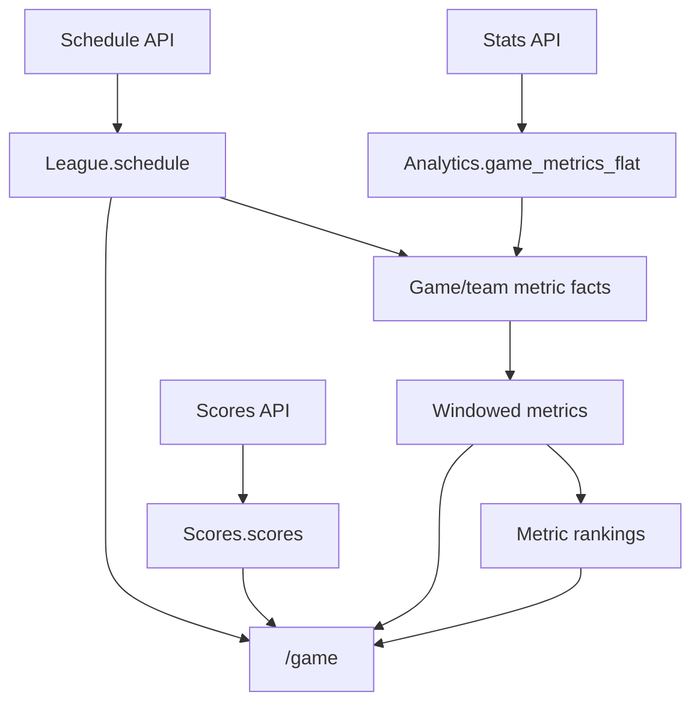

# GameLens Backend August Readiness Roadmap

**Last revised:** 2026-07-29
**Status:** Canonical working roadmap
**Code source of truth:** Current `meow/dev`
**Current packet:** Packet 2 — Metric pipeline conductor (`NEXT`)

This document replaces the earlier August plan and implementation-map drafts. It is the single practical roadmap for backend readiness.

The standard is intentionally modest:

> Make the 2026 data path dependable, test each change locally, and preserve the claim-learning work already completed.

GameLens is not being redesigned. Existing metric builders, `/game` logic, Levels 1–4, Claim Health, and historical QA results should be reused.

---

## 1. What August readiness means

The August must-have is:

```text
Valid scheduled NFL data
→ dependable source tables
→ Facts
→ Windowed Metrics
→ Rankings
→ useful pregame-safe /game response
```

Levels 1–4 are the next learning track. They are important, but they do not need to become scheduled production jobs before `/game` is ready.

### Source and runtime map



Required metric build order:

```text
Analytics.game_team_metric_facts_{season}
→ Analytics.team_metrics_windowed_{season}
→ Analytics.team_metric_rankings_{season}
```

### Claim-learning map

```text
Pregame-safe /game analysis
→ Level 1 claim extraction
→ final box score and completed-game Facts
→ Level 2 postgame validation
→ Level 3 feature enrichment
→ Claim Health
→ Level 4 calibration review when the sample is large enough
```

### Product-usage map

```text
User selects a game
→ frontend navigates to the matchup
→ GET /game/<game_id>
→ response is displayed
```

A user selection, a saved game-level outcome, and a claim-training row are different records.

User interest may later help prioritize teams, games, and explanations. It is not evidence that a football claim was correct and should not raise model confidence.

---

## 2. Current truths

These are the working assumptions this roadmap protects.

| Area                     | Current behavior                                                                                                                                                                                       | Roadmap decision                                                                                                         |
| ------------------------ | ------------------------------------------------------------------------------------------------------------------------------------------------------------------------------------------------------ | ------------------------------------------------------------------------------------------------------------------------ |
| Schedule                 | Schedule ingestion supplies `League.schedule`, including game identity, status, season, teams, and dates.                                                                                              | Preserve it as the shared game identity source.                                                                          |
| Stats                    | The Stats loader appends parsed rows to `Analytics.game_metrics_flat` and updates the box-score-loaded marker. Its return value represents successfully processed **games**, not inserted metric rows. | Validate before insertion and name the count truthfully.                                                                 |
| Stats retry behavior     | A marker failure can leave inserted metric rows eligible for another retry.                                                                                                                            | Prevent a retry from blindly appending the same game again.                                                              |
| Facts duplicate handling | The Facts builder de-duplicates the grain `season + game + team + metric`.                                                                                                                             | Useful protection, but not a substitute for safe ingestion because corrected duplicate values have no reliable ordering. |
| Scores                   | The Scores loader can construct two rows even when its home/away line-score objects are empty.                                                                                                         | Validate meaningful score content; `len(rows) == 2` is insufficient.                                                     |
| `/game` final score      | `/game` reads final-score data directly from `Scores.scores`.                                                                                                                                          | Scores safety belongs in the August source track.                                                                        |
| Targeted runs            | `app.py` can pass `load_date` through the configured calls, but the loader signatures are not consistently aligned.                                                                                    | Normalize this small interface while each loader is already being edited.                                                |
| Scheduler errors         | The current scheduler catches individual API errors and can still return a success response.                                                                                                           | Return a truthful success, no-op, partial failure, or failure.                                                           |
| Legacy aggregation       | `app.py` still calls the annual 2025 aggregate after Stats reports activity.                                                                                                                           | Replace only this hook after the new metric conductor is tested.                                                         |
| Facts builder            | `run_build_game_team_metric_facts()` already builds, validates, dry-runs, and writes the season table.                                                                                                 | Reuse it.                                                                                                                |
| Windowed builder         | `run_build_windowed_metrics()` already builds, validates, dry-runs, and writes the season table.                                                                                                       | Reuse it.                                                                                                                |
| Rankings builder         | The existing rankings job produces `team_metric_rankings_{season}`.                                                                                                                                    | Reuse it after confirming its current callable entry point on `dev`.                                                     |
| `/game` pregame safety   | Team metrics and rankings are selected strictly before the target game date.                                                                                                                           | Preserve this rule.                                                                                                      |
| Level 2                  | Validation uses completed-game Facts and merges by `run_id + claim_key`.                                                                                                                               | Reuse it; it is already broadly retry-friendly.                                                                          |
| Claim Health             | Admin reads claim-training examples for a selected `run_id`.                                                                                                                                           | Keep Claim Health in the learning path, separate from click tracking.                                                    |
| Final-game GET           | A final `/game/<game_id>` request may save a game-level outcome and trust details.                                                                                                                     | Do not confuse this side effect with Level 1 or user-event logging.                                                      |

---

## 3. The 80% scope decision

### Build now

* A pure box-score validator with focused tests
* Stats acceptance, marker, and retry safety
* Score validation and game-scoped retry safety
* One small Facts → Windowed → Rankings conductor
* A deliberate 2026 schema/build/runtime smoke test
* Final activation through current `app.py`

### Build after the August path is stable

* Game-scoped cumulative Level 1 production writes
* Levels 2–3 learning orchestration
* Claim Health pointed at the production learning run

### Do not build yet

* A new `ready/degraded/blocked` readiness subsystem
* A generalized multi-season scheduler
* A pipeline-run ledger table
* Mandatory immutable pregame snapshot storage
* Automatic daily Level 4 policy changes
* User-click analytics
* A `/game` SQL view or table-valued function
* A redesign of final-game model-outcome storage
* Broad refactors, renames, or formatting cleanup

For August, one explicit configured active season (`2026`) is acceptable. Historical or multi-season backfills can call the builders manually with an explicit season. Dynamic season discovery can wait until it solves a real problem.

---

## 4. Safety contract

1. Start every implementation packet from current `meow/dev`.
2. Patch `app.py` last and preserve all current routes and authentication behavior.
3. Reject incomplete source payloads before marking a game loaded.
4. Do not rely on downstream de-duplication to make source retries safe.
5. Rebuild the three metric tables only after accepted Stats data exists.
6. Do not make Levels 1–4 prerequisites for `/game`.
7. Never reuse a historical QA `run_id` for production learning writes.
8. Never replace an entire cumulative production Level 1 run to update one game.
9. Keep Level 4 focused on claim-language support, not winner confidence.
10. Do not automatically apply Level 4 recommendations to runtime language.
11. Avoid a “readiness” test that silently calls final-game `get_game_details()` and writes model outcomes.
12. Stop after each locally proven, meaningful commit.

The season tables are intentionally rebuilt in full by the existing builders. That is acceptable after source validation. Claim-training history is different: production reruns must be game-scoped.

---

## 5. Code-change working agreement

When we implement a packet:

* If one Python function changes, provide the complete replacement function.
* If several tightly coupled functions change, provide the complete file.
* Identify the filename and exact function being replaced.
* Include focused tests with the behavior change.
* Do not mix cleanup with the requested behavior.
* Christian applies the change locally, runs it, examines the result, and commits before the next packet.
* Each commit should make one new behavior true.

This roadmap specifies behavior and test boundaries. Exact code is chosen only after reading the full current function on `dev`.

---

# Track A — August must-have

## Packet 0 — Baseline and branch

**Status:** `COMPLETE`

**Evidence:** Work began from confirmed branch `dev` at baseline commit `77690e3`; the branch and relevant source files were inspected before Packet 1A.

**Goal:** Know the starting point before changing behavior.

Before Packet 1:

* update or compare the local branch with `meow/dev`;
* record the current commit;
* run the closest existing ingestion tests;
* confirm the current Stats, Scores, config, rankings, and `app.py` function signatures;
* create a focused working branch.

No production or BigQuery change occurs.

---

## Packet 1 — Safe source ingestion

### Packet 1A — Pure Stats box-score validator

**Status:** `COMPLETE`

**Evidence:** Commit `b95adbc` (`Add NFL box score validation gate`); all 11 focused validator tests passed. The validator remains pure and is not imported by production ingestion.

**Goal:** Decide whether a Tank01 Stats response is safe to parse and load.

**Create:**

```text
api_calls/api_utils/validate_nfl_boxscore.py
tests/api_calls/test_validate_nfl_boxscore.py
```

The validator should be pure: payload in, structured acceptance/rejection result out. It should not call Tank01, BigQuery, or the scheduler.

**Test at least:**

* valid final game with both teams and meaningful stats;
* non-final game;
* final status with an empty or skeleton body;
* only one team represented;
* missing game or team identity;
* malformed stat content;
* legitimate zero-valued statistics.

**Behavior impact:** None. Production does not import it yet.

**Done when:**

```text
payload
→ accepted
or
→ rejected with a useful reason
```

**Commit:**

```text
Add NFL boxscore payload validator and tests
```

### Packet 1B — Stats acceptance and retry safety

**Status:** `COMPLETE`

**Evidence:** Packet 1B implementation commit `c7e9e98`; the combined Packet 1A/1B focused suite ran 19 tests successfully, and the validator, Stats loader, and both focused test files compiled successfully. Commit `b4ff2fa` then merged the current `main` application baseline into `dev` while preserving the Packet 1A/1B files unchanged. The merge was pushed, and local `dev` and `origin/dev` were confirmed synchronized at `0 0`.

**Goal:** Publish only complete Stats data and keep retries from creating ambiguous duplicates.

**Update:**

```text
api_calls/api_call_nfl_stats.py
```

**Required sequence:**

```text
fetch response
→ validate
→ parse
→ confirm meaningful rows for both teams
→ insert or safely reconcile this game
→ confirm stored data
→ mark box score loaded
→ count the game as processed
```

**Required behavior:**

* A rejected response inserts nothing and leaves the game retryable.
* A marker is never written before valid Stats rows are confirmed.
* A marker-write failure is not counted as full success.
* A retry checks/reconciles existing rows for that game instead of blindly appending another copy.
* Existing complete rows plus a missing marker can be repaired without duplicating the game.
* The returned integer continues to mean processed games unless implementation proves a small result object is necessary.
* Variable names and log messages say `games`, not `rows`.
* The loader accepts the scheduler's optional `load_date` contract consistently, even if the parameter only influences eligibility indirectly.

The exact retry implementation may use a game-scoped existence/quality check, merge, or game-scoped replacement. Choose the smallest approach that fits the current loader.

**Local tests:**

1. Invalid response → no insert and no marker.
2. Valid response → insert confirmed before marker.
3. Insert failure → no marker and no success count.
4. Marker failure → run reports failure/incomplete.
5. Retry with complete existing rows → no duplicate insert.
6. Rejected game remains eligible for a later retry.

**Behavior impact:** Scheduled Stats acceptance changes.

**Commit:**

```text
Gate NFL stats loading and make retries safe
```

### Packet 1C — Score validation and retry safety

**Status:** `COMPLETE`

**Evidence:** Implementation commit `67e2212` (`Validate and safely retry NFL score loads`). The combined Packet 1A/1B/1C focused suite ran 31 tests successfully, and the Stats/Scores loaders plus both focused loader test files compiled successfully. The live `Scores.scores` and `Scores.score_status` schemas were inspected before implementation; Packet 1C preserves the existing 13-column score-row contract and two-column status contract.

**Goal:** Prevent empty final-score rows and repeated game rows from entering `Scores.scores`.

**Update:**

```text
api_calls/api_call_nfl_scores.py
```

A small pure validation function can live in this file unless the current code shows genuine reuse elsewhere. Do not create a generalized validation framework.

**Required behavior:**

* Require a final game and meaningful home/away score content.
* Require both team types and the game identity.
* Do not treat two constructed dictionaries as proof of valid source data.
* Reject empty `lineScore` objects.
* Make the two game rows safe to retry through a game-scoped merge, replacement, or verified no-op.
* Align the optional `load_date` signature with the scheduler.

**Local tests:**

1. Empty home/away line scores → no write.
2. One missing team → no write.
3. Valid final score → exactly one home and one away row.
4. Same game retried → still exactly one valid row per team.
5. Valid correction → the stored game can be repaired without affecting other games.

**Behavior impact:** Scheduled score acceptance changes.

**Commit:**

```text
Validate and safely retry NFL score loads
```

---

## Packet 2 — Metric pipeline conductor

**Status:** `NEXT`

**Goal:** Call the existing season builders in the only valid order.

**Create:**

```text
services/gamelens_pipeline_orchestrator.py
tests/services/test_gamelens_pipeline_orchestrator.py
```

**Required order:**

```text
Facts
→ Windowed Metrics
→ Rankings
```

Confirm the current callable entry point in `build_metric_rankings.py` before implementation.

The conductor should:

* accept one explicit season;
* call the existing builders without copying their logic;
* stop when a stage raises or returns an invalid result;
* return a small plain summary containing the season, stage statuses, and row counts;
* log the failed stage;
* contain no Level 1–4 work.

Do not add a run-ledger table, custom workflow engine, retry queue, or generalized task framework.

**Local tests:**

1. Verify Facts → Windowed → Rankings call order.
2. Facts failure prevents both later builders.
3. Windowed failure prevents Rankings.
4. The returned summary names completed, skipped, and failed stages truthfully.
5. Existing builders complete a historical 2025 dry run/read-only comparison.

**Behavior impact:** None until `app.py` calls the conductor.

**Commit:**

```text
Add GameLens metric pipeline conductor
```

---

## Packet 3 — 2026 operational checkpoint

**Goal:** Prove the existing metric system can support 2026 before scheduling it.

This is primarily a deliberate local/BigQuery checkpoint, not a new subsystem.

### Schema and build checks

* Use the existing metric-table setup script.
* Compare the 2025 and 2026 schemas.
* Confirm `lens_tags` remains a repeated string field.
* Confirm expected partitioning/clustering if the setup script uses it.
* Run the three builders manually for 2026.
* Record source and output row counts.
* Inspect a small sample from each output table.

Required tables:

```text
Analytics.game_team_metric_facts_2026
Analytics.team_metrics_windowed_2026
Analytics.team_metric_rankings_2026
```

### Runtime smoke check

Use an eligible scheduled 2026 game and verify:

* the schedule/header resolves;
* both teams obtain the expected pregame-safe metrics when history exists;
* rankings appear when prior ranking history exists;
* legitimate early-season absence is explained or safely omitted;
* the response renders without changing matchup logic.

Do not create a new readiness service unless this smoke test exposes a recurring problem that existing tests cannot express.

**Behavior impact:** Only the deliberate 2026 table setup/build.

**Commit:** None unless code or the existing setup script actually changes.

---

## Packet 4 — Activate through `app.py`

**Goal:** Replace the legacy annual aggregate hook with the tested metric conductor.

**Update last:**

```text
app.py from current meow/dev
```

**Required behavior:**

```text
run Schedule → Stats → Scores
→ no accepted Stats games: successful no-op for metric builds
→ accepted Stats games: run Facts → Windowed → Rankings for configured 2026
→ return truthful stage results
```

Keep this practical:

* Use one explicit configured active season for August.
* Preserve every blueprint, route, auth check, and scheduler entry point on current `dev`.
* Remove only the old `aggregate_nfl_metrics_2025` hook.
* Rename Stats variables/logs from inserted rows to processed games.
* Do not report full success when an ingestion or metric stage failed.
* A Scores failure should be visible because `/game` final-score data depends on `Scores.scores`; do not silently claim total pipeline success.
* Keep the existing targeted `load_date` path working after Packet 1 normalizes loader signatures.

**Local tests:**

1. No accepted Stats games → metric conductor not called and response reports a successful no-op.
2. Accepted Stats games → conductor called once for 2026.
3. Stats failure → downstream metric build not reported as successful.
4. Scores failure → overall result is partial failure or failure, not full success.
5. Metric-stage failure → failed stage named truthfully.
6. Targeted `load_date` reaches Schedule, Stats, and Scores consistently.
7. `/health`, `/games`, `/game`, Admin, user-management, and all other current routes remain registered.
8. Existing auth behavior remains unchanged.

**Behavior impact:** This is the production activation commit.

**Commit:**

```text
Activate GameLens metric rebuilds after accepted stats
```

---

## Packet 5 — Preseason rehearsal and replay proof

**Goal:** Prove the scheduled path can run, no-op, fail visibly, and replay safely.

Run at least:

* no eligible games;
* incomplete Stats response;
* valid completed game;
* duplicate/retry of the same completed game;
* score correction;
* one forced builder failure;
* targeted `load_date` run.

Record:

* accepted/rejected game counts and reasons;
* output row counts;
* which stages ran, skipped, or failed;
* whether the retry duplicated data;
* whether `/game` remained usable;
* whether existing routes and `/game` logic remain intact;
* whether historical QA tables were unchanged.

**Done when:**

```text
The August path can distinguish:
no new usable data
vs
accepted new data and successful rebuild
vs
partial failure
vs
failure
```

---

# Track B — claim-learning productionization

This track begins only after the August `/game` path is dependable.

## Level 1 — Production claim generation

**Current truth:** Level 1 exists and generates pregame-safe claim examples. The missing work is cumulative production writing and orchestration.

Create a distinct production `run_id`, for example:

```text
production_daily_2026_claim_training
```

Requirements:

* Generate or load pregame-safe `/game` payloads for the selected final games.
* Preserve historical 2023–2025 QA runs.
* Merge one game's claims by stable grain such as `run_id + claim_key`, or delete/reinsert only that game within the production `run_id`.
* Never use whole-run replacement to update one game in a cumulative production run.
* Persist the production row before Level 2.

## Level 2 — Completed-game validation

**Current truth:** `update_claim_training_validation.py` already reads completed-game Facts, validates claims, and merges by `run_id + claim_key`.

Requirements:

* Run only after completed-game Facts exist.
* Reuse the existing updater unless a proven gap appears.
* Treat missing evidence as missing, not as a failed claim.

## Level 3 — Feature enrichment and Claim Health

**Current truth:** Level 3 enriches claim rows and Claim Health reads the selected `run_id`.

Requirements:

* Run after Level 2.
* Point Claim Health at the production run through explicit configuration or an equally small mechanism.
* Preserve historical QA and calibration run IDs.

## Level 4 remains manual and reviewable

Level 4 should stay a review step, not an automatic daily policy changer.

What it should do:

* summarize validation by confidence and core area;
* compare current vs calibrated claim-language treatment;
* show where high-confidence language is unsupported;
* preserve review artifacts and sample sizes.

What it should not do:

* change winner confidence;
* rewrite runtime language automatically;
* auto-approve a recommendation from a small sample;
* overwrite prior QA runs.

---

# Track C — later backlog

| Item                             | Why later                                                                    |
| -------------------------------- | ---------------------------------------------------------------------------- |
| User click analytics             | Useful product-interest data, but not football truth.                         |
| Durable game-selection events    | Needs a separate event design and privacy/retention decision.                 |
| Pipeline run ledger              | Logs and truthful stage summaries are enough for the first August version.    |
| Admin daily snapshots            | Live Claim Health can remain while production learning stabilizes.            |
| Dynamic multi-season discovery   | One explicit active season is acceptable for August.                          |
| `/game` SQL view or table function | Existing query/service separation is adequate unless profiling proves otherwise. |
| Mandatory pregame snapshot store | Current strict-before-date queries already enforce the key product rule.       |

---

## 6. Minimal observability

Do not begin with a BigQuery run-ledger table.

The first operational version needs structured logs and a small returned summary containing:

```text
season
schedule status/count
stats accepted/rejected/skipped counts
scores accepted/rejected/skipped counts
facts status/count
windowed status/count
rankings status/count
failed stage
warnings
```

Every stage should distinguish:

```text
success
no-op/skipped
partial failure
failure
```

No alert integration is required for the first August pass. Add one only after the core path runs reliably enough that an alert means something useful.

---

## 7. Evidence to preserve

For each packet, record:

* the commit hash and message;
* the exact local test command and result;
* important row counts;
* accepted and rejected source counts;
* retry results;
* 2026 table schema and build evidence;
* any deliberate BigQuery write.

Keep the evidence short. A stand-up entry or compact roadmap status note is enough. Do not bury the result in a new large document.

---

## 8. Session restart checklist

At the start:

* read this roadmap;
* name the current packet;
* confirm the latest completed commit;
* compare with current `meow/dev`;
* inspect the complete affected function;
* state whether the packet is inert or changes production;
* state the exact local test that proves success.

At the end:

* record the test command and result;
* record important row counts;
* record the commit hash/message;
* mark the packet complete or blocked;
* name only the next packet.

---

## 9. Decisions that should not drift

* Schedule, Stats, and Scores have separate source destinations.
* Stats success means processed games, not inserted metric rows.
* Facts → Windowed Metrics → Rankings is the required builder order.
* `/game` uses historical data strictly before the target game date.
* Early-season ranking absence can be legitimate.
* `/game` availability and Levels 1–4 success are separate.
* Level 1 contains pregame-safe claims.
* Level 2 compares claims with completed-game Facts.
* Level 3 enriches claim rows with explanatory features.
* Level 4 calibrates claim-language support, not winner confidence.
* Claim Health belongs to the claim-learning path.
* Frontend selection is not currently a durable learning event.
* `app.py` is the final activation seam.

---

## 10. Next action

Begin Packet 2 only:

```text
Confirm current meow/dev and a clean working tree
→ inspect the complete current Facts, Windowed Metrics, and Rankings callable entry points
→ define the smallest plain conductor interface
→ add focused call-order and stop-on-failure tests
→ run locally
→ commit
→ stop
```

Packet 2 is inert until `app.py` calls it. Create only the small conductor and its focused tests. Do not change `app.py`, source ingestion, `/game`, lens tags, or Levels 1–4.
