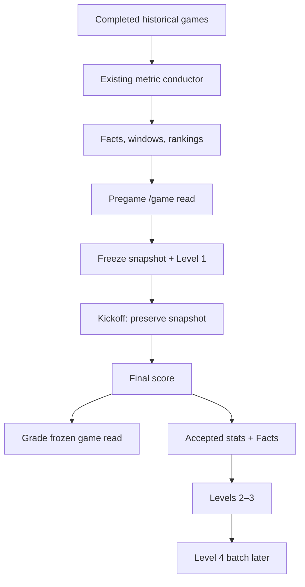

# GameLens Learning Orchestration Product Sprint

**Document status:** Fifth-pass architecture consolidated; second-pass document review complete; implementation not started  
**Created:** 2026-08-06  
**Owner:** GameLens product stewardship  
**Repository:** `csells10/meow`  
**Branch baseline reviewed:** `main` at `d9d261980d0c1ca9dd3994b84a57bfb2b3a1713e`  
**Companion architecture:** [GameLens_Product_Data_Collection_and_Learning_Handoff.md](./GameLens_Product_Data_Collection_and_Learning_Handoff.md)  
**Production release evidence:** [go_plan.md](./go_plan.md)

---

## 1. The decision

GameLens needs one additional **small learning conductor**, but it must not replace or duplicate the production ETL, the metric conductor, `/game`, or the existing Level workers.

"Additional conductor" means one small coordination module. It does **not** mean a second daily Scheduler, a second ingestion path, or a general workflow framework.

The existing production path remains responsible for completed-game data:

```text
Schedule -> Stats -> Scores
                 -> accepted Stats gate
                 -> Facts -> Windowed Metrics -> Rankings
```

The learning conductor coordinates three deliberately separate jobs:

1. **Before kickoff:** capture and freeze the pregame payload, then store Level 1 claims.
2. **After final data is ready:** grade the frozen game read, then run Levels 2 and 3 for games that have both a valid Level 1 capture, a final score, and accepted completed-game Facts.
3. **After enough evidence accumulates:** run Level 4 as a controlled calibration batch.

This preserves the 2023–2025 feature work without allowing postgame data to leak into a prediction.

The recommended future module name is:

```text
services/gamelens_learning_pipeline_conductor.py
```

The name is provisional until Packet 1 confirms the current interfaces. The architectural boundary is not provisional.

### The normal daily path, in plain English

The existing 8:00 a.m. Eastern production run remains the daily trigger. When learning is eventually enabled, that same run should finish in this order:

| Order | Job | Existing or new? | Plain-language result |
|---:|---|---|---|
| 1 | Refresh Schedule, Stats, and Scores | Existing | Learn what games exist and which older games have finished |
| 2 | Rebuild Facts, Windowed Metrics, and Rankings when Stats were accepted | Existing metric conductor | Refresh the historical evidence used by GameLens |
| 3 | Finish older-game learning | New conductor calling existing workers | Grade frozen game reads, validate claims, and attach Level 3 context for ready final games |
| 4 | Freeze eligible future games | New conductor calling existing `/game` and Level 1 logic | Save the upcoming pregame read before kickoff |
| 5 | Return one truthful run summary | Existing summary pattern, extended | Show what succeeded, skipped, failed, or had nothing to do |

Level 4 is not part of every daily run. It runs later as a controlled weekly or evidence-threshold batch.

This order matters: completed historical evidence is refreshed first, older games finish learning second, and only then are new pregame reads frozen. If the current metric rebuild fails, do not freeze a new snapshot from a potentially mixed table state.

---

## 2. Why the earlier descriptions felt contradictory

Two different jobs were being described with the same word: **features**.

| Meaning | When it exists | What it does |
|---|---|---|
| Runtime pregame feature metadata | Before kickoff | Helps `/game` describe the matchup from pregame-safe metrics and rankings |
| Persisted Level 3 training features | After Level 1 has been captured; currently processed after final with Level 2 | Adds the same type of pregame-safe context to saved claim rows so historical validation and calibration can learn from it |

Level 3 running after final does **not** mean its input may use the final score or the evaluated game's postgame facts. Level 3 is scheduled after Level 2 for a convenient learning workflow, but its feature inputs remain pregame-only.

The live `/game` response already exposes guarded metadata such as `two_way_context_v1` and `offensive_efficiency_support_v1`. That runtime exposure is useful before kickoff, but it is not proof that persisted Levels 1–4 ran.

### What this second pass corrects from the May readiness plan

The May plan was valuable planning evidence, but current `main` has moved forward. It now has structured ingestion summaries, the Stats-gated metric conductor, and the protected Admin claim-health route. The learning sprint should fill the remaining gap instead of rebuilding those pieces.

| Older planning idea | Second-pass decision |
|---|---|
| Collect `/game` payloads for newly final games, then run Level 1 | Level 1 must come from a real pregame capture; never recreate it after final |
| Run Levels 1–4 as one daily chain | Level 1 runs before kickoff; game grading plus Levels 2–3 run after final data; Level 4 runs later in a batch |
| Create another broad pipeline orchestrator | Add a narrow learning conductor that calls the current service and workers |
| Build a separate payload generator for automation | Reuse `services/game_service.py` as the one canonical payload builder |
| Create a new Admin refresh warehouse immediately | Let the existing Admin service read canonical tables; add storage only if Packet 5 proves a missing operational need |
| Reimplement claim extraction for production | Adapt the existing `extract_claim_rows(...)` path so historical QA and production capture share one extractor |

---

## 3. The two clocks



The first clock produces the prediction and explanation. The second clock evaluates that frozen evidence so future predictions can improve.

### Clock A — before kickoff

1. Use only completed games dated before the target game's kickoff.
2. Read the latest healthy Facts, Windowed Metrics, and Rankings.
3. Reuse the existing Schedule lookahead (today plus the next two dates) and select only scheduled games whose kickoff is still strictly in the future.
4. Build the normal pregame response once through the existing game service; do not create a second payload builder or call the public HTTP route from inside the backend.
5. Save the first valid response as the one canonical snapshot for that game and cohort.
6. Extract and persist Level 1 claims with the existing claim-extraction logic.
7. Freeze the displayed pregame read.

If the daily run accepted no new Stats, the last known healthy metric tables may still support capture. If the current metric rebuild failed, capture skips and reports why.

### Clock B — after the game

1. Collect the final score and completed box-score/stat data.
2. Run the existing Facts -> Windowed Metrics -> Rankings conductor when new Stats were accepted.
3. Use the frozen matchup read plus the final score to grade game outcome and Model Trust; do not rebuild the original pregame cards.
4. Require the valid capture, final score, and accepted game Facts before admitting the game to Levels 2–3.
5. Run Level 2 claim validation.
6. Run Level 3 feature enrichment using only the saved pregame inputs.
7. Let `/admin` read the updated canonical game-outcome and claim tables; do not add a duplicate refresh job.
8. Let Level 4 run later, after a meaningful sample exists.

---

## 4. Frontend lifecycle and Levels 1–4

The Levels are primarily a learning lifecycle, not four frontend data sources. The frontend receives a pregame product read, preserves it, and later reveals outcome/evaluation sections.

| Frontend section | Before kickoff | In progress | After final | Level relationship |
|---|---|---|---|---|
| Game Profile | Show | Preserve unchanged | Preserve unchanged | Runtime `/game` creates it; Level 1 freezes its claims; Level 2 later validates applicable claims; Levels 3–4 analyze future reliability |
| Core Area Advantage | Show | Preserve unchanged | Preserve unchanged | Runtime `/game` creates it; Level 1 freezes it; Level 2 validates; Levels 3–4 segment and calibrate the evidence |
| Matchup Lean | Show | Preserve unchanged | Preserve unchanged | Runtime `/game` creates it; Level 1 freezes it; separate game calibration grades it after final; Level 4 may recommend a future guarded change but does not rewrite this game |
| Team Comparison | Show | Preserve unchanged | Preserve unchanged | Runtime `/game` creates it; Level 1 freezes claim rows; Level 2 validates; Level 3 attaches pregame feature context |
| Pregame Model Read | Show | Preserve unchanged | Preserve unchanged | Pregame capture freezes it; Level 1 extracts its claim evidence; the separate game-outcome path evaluates it after final |
| Live / Final Score | — | Show if available | Show final | Scores ETL; not a Level 1–4 product |
| Model Trust & Outcome | — | Do not grade | Show when a final score and valid pregame capture exist | Existing outcome/trust logic grades the frozen pregame read; separate from claim validation |
| Claim Validation | — | — | Admin/internal after Facts are ready | Level 2 |
| Claim Feature Health | Optional Admin/debug only | — | Admin/internal | Level 3 |
| Calibration Summary | — | — | Admin after a batch | Level 4 |

### Frontend rule

Once kickoff occurs, never rebuild the pregame cards from newly available postgame evidence. The postgame response has four clear sources:

1. Pregame cards come from the saved snapshot.
2. Live/final score comes from Scores ETL.
3. Model Trust & Outcome comes from grading the saved matchup read against the final score.
4. Claim Validation and feature/calibration health remain internal Admin evidence.

The frontend renders these sections. It does not recalculate, persist, or repair them.

---

## 5. What each Level actually owns

| Level | Trigger | Reads | Writes | Must never do |
|---|---|---|---|---|
| Level 1 | Valid capture before kickoff | Immutable pregame snapshot | One row per saved claim | Read final score, actual winner, final margin, current-game postgame metrics, or replace an entire cumulative cohort |
| Level 2 | Valid capture plus final score plus accepted Facts | Level 1 rows and current game's postgame Facts | Validation result and actual evidence fields | Change the frozen prediction or treat a winner miss as automatic claim failure |
| Level 3 | Same admitted game, after Level 2 completes without a stage failure | Saved pregame fields and registry metadata | Feature scores, buckets, versions, context | Use `validation_result`, final score, actual winner, actual gap, or any other target as a feature input |
| Level 4 | Weekly or evidence threshold | Accumulated validated/enriched claim rows | Calibration summaries and recommendations | Run per game, hide small samples, or automatically steer matchup lean, confidence, Model Trust, or frontend copy |

One-time schema setup is not a fifth learning Level.

Level 3 follows Level 2 to keep one simple postgame operating path. That is a scheduling choice, not permission to use Level 2 results as Level 3 inputs. If Level 2 reports a real stage failure, Level 3 waits; ordinary `unavailable` claim rows are data and do not fail the stage.

### May feature work preserved

The following work remains useful and is not discarded:

- `clean_hierarchy_context_v1`;
- `offense_finish_score`;
- `defensive_suppression_score`;
- `two_way_edge_score`;
- `two_way_context`;
- `claim_strength_context_v1`;
- `offensive_efficiency_support_v1`; and
- Core Area durability/calibration research.

These are pregame-safe feature or calibration ingredients. Some are already visible as metadata. None should silently become winner logic.

---

## 6. Component boundaries

### DRY rules for this sprint

| One source of truth | Reuse rule |
|---|---|
| Pregame product payload | Build it through `services/game_service.py`; never create a second GameLens response builder |
| Metric meaning and guardrails | Read `analytics/metric_registry.py`; never copy metric definitions into the conductor |
| Level 1 claim extraction | Reuse `extract_claim_rows(...)`; adapt its inputs instead of writing a production-only extractor |
| Game outcome and Model Trust | Reuse the existing outcome/trust builders and persistence path with the frozen snapshot |
| Ingestion-style game summaries | Reuse `api_calls/api_utils/ingestion_summary.py` where its existing fields fit |
| Claim features and calibration formulas | Keep them in the Level 3 and Level 4 workers; the conductor only calls them |
| Admin calculations | Keep them in the current Admin query/service layer; do not reproduce them in the ledger |

Do not build a generic workflow engine for two conductors. Match the existing result shape, share a helper only where the same behavior is genuinely repeated, and keep football calculations out of `app.py` and the conductor.

### Keep unchanged initially

| Existing component | Responsibility |
|---|---|
| `app.py`, `config.py`, and the existing ingestion summary helper | Scheduler entry point, current Schedule -> Stats -> Scores order, and high-level execution summary |
| `services/gamelens_metric_pipeline_conductor.py` | Facts -> Windowed Metrics -> Rankings |
| `/game` and `services/game_service.py` | Canonical product-response, game-outcome, and Model Trust calculations |
| `agg/gamelens_training/build_claim_training_examples.py` | Existing Level 1 claim extraction and historical QA CLI |
| `agg/gamelens_training/update_claim_training_validation.py` | Level 2 calculation |
| `agg/gamelens_training/update_claim_training_features.py` | Level 3 calculation |
| `agg/gamelens_training/build_claim_language_calibration.py` | Level 4 analysis/calibration |
| `/admin/gamelens/claim-health` | Read and explain game calibration and claim health |

### Add or adapt in small pieces

| Needed piece | Minimum responsibility |
|---|---|
| Pregame capture service | Select eligible scheduled games, call the canonical game service in-process, reject postgame-shaped payloads, and save an immutable snapshot/manifest |
| Production-safe Level 1 adapter | Pass one approved capture through the existing extractor and MERGE by a deterministic game-scoped key |
| Callable worker entry points | Move CLI orchestration into reusable functions for Levels 2–4 while keeping the current CLIs as thin wrappers |
| Learning conductor | Select eligible games and call pregame, outcome, Level 2, Level 3, and batch workers with explicit gates and truthful summaries |
| Minimal learning ledger, only if needed | Extend the current run evidence with stage status, reason, counts, errors, and identifiers; do not duplicate Admin metrics |
| Focused tests | Prove timing, no-op, retry, partial-failure, and leakage behavior |

### Do not build yet

- a second replacement ingestion framework;
- a real-time event bus;
- a new frontend rules engine;
- an automatic self-modifying model;
- a new Admin summary warehouse when the existing canonical tables can answer the question;
- a second daily Scheduler for the learning conductor;
- a per-game Level 4 trigger;
- a full model-training platform; or
- a refactor of unrelated `/game` code.

---

## 7. Identifier and replay contract

| Identifier | Scope | Rule |
|---|---|---|
| `pipeline_run_id` | One Scheduler/manual ETL execution | Operational lineage only |
| `learning_run_id` | Stable season + phase + ruleset cohort | Do not create a new value every day |
| `capture_id` | One immutable canonical pregame snapshot for one game | Use one deterministic identity per `learning_run_id + game_id`; the first valid capture wins |
| `snapshot_hash` | Proof of the exact saved payload | Record it in the manifest; do not use a changed payload to overwrite the first capture |
| `claim_key` | One claim within one capture | Keep the current deterministic extractor key and MERGE by `learning_run_id + claim_key` |

Recommended cohort separation:

```text
2026_preseason_shadow_<ruleset>
2026_regular_season_<ruleset>
```

Never mix preseason rehearsal rows into the regular-season Admin cohort. Never reuse the historical QA run IDs.

The daily `pipeline_run_id` changes, but it does not create a new learning cohort. Every saved claim must trace back to `pipeline_run_id`, `learning_run_id`, `capture_id`, and `claim_key`.

The current Level 1 `--replace-run` behavior remains available for bounded historical QA, but it is unsafe for refreshing one game inside a cumulative production cohort. Production Level 1 uses the exact MERGE key above; it does not delete or replace the rest of the cohort.

---

## 8. Edge-case contract

Follow the result pattern already present in `app.py` and ingestion. Keep the top-level learning result small:

```text
success
no_op
partial_failure
failure
```

Individual games/stages may be `success`, `failed`, `skipped`, or `quarantined`, always with a plain reason. The conductor may normalize an existing worker's wording at its boundary; do not refactor a working worker only to rename a status.

Blank data is not automatically an exception. The result depends on what the stage was entitled to expect.

| Situation | Required behavior | Downstream action |
|---|---|---|
| No games scheduled for the capture window | Capture returns `no_op` with zero counts | Other ready postgame work may still run |
| Games exist but none are inside the capture window | `no_op` | Retry on the next scheduled opportunity |
| Valid pregame `/game` payload has no rankings or few/no claims | Save the truthful snapshot; Level 1 may write zero claims with a reason | Do not manufacture features or claims |
| Upstream API returns an empty list on a valid no-game day | `no_op` | Do not retry as an error storm |
| Upstream API returns blank/malformed data for an expected game | `partial_failure` or `failure` for that game | Preserve other games; record the failed game and reason |
| Capture request is repeated before kickoff | Return the existing canonical capture or identical MERGE result | No duplicate snapshots or claims |
| Capture attempt occurs at/after kickoff | Reject or quarantine | Never reconstruct Level 1 from postgame `/game` |
| Existing model-outcome row does not trace to the canonical capture | Quarantine the grade conflict with both identities | Do not silently accept or overwrite a postgame-rebuilt grade |
| Final score exists but Stats/Facts do not | Grade Model Trust & Outcome from the frozen snapshot; Levels 2–3 `skipped` | Show the result and retry claim learning after Facts are ready |
| Stats/Facts exist but final score is unavailable | Metrics may finish, but outcome grading and Levels 2–3 wait | Retry when Scores ETL supplies the final score |
| Some final games succeed and others fail | `partial_failure` with per-game results | Run learning only for ready games |
| Facts builder returns empty after accepted Stats | Metric pipeline `failure` | Do not run Levels 2–3 or freeze new snapshots from the failed run |
| Current metric rebuild fails after an earlier stage wrote | Preserve existing captures and report the failed boundary | Do not capture future games until a fully healthy metric state is restored |
| A Level 2 metric is unavailable | Write `unavailable` with reason | Do not hide or convert it to failed claim |
| Level 3 fails | Mark the stage `failed`; top-level result becomes `failure` or `partial_failure` | Do not make the game Level 4-eligible |
| Level 4 sample is too small | Produce counts and `insufficient_evidence` | No runtime steering |
| Tie | Game outcome is Push/No Decision; claims still validate independently | Reconcile both scorecards |
| Postponed/cancelled/rescheduled game | Preserve prior manifests and record state change | Do not overwrite a valid snapshot with postgame data |
| Scheduler or Cloud Run retries | Reuse deterministic IDs and keys | Same final rows, no duplicates |
| Timeout/OOM | Record failed stage and leave prior good tables/snapshots intact | Safe retry from the failed boundary |

### Missing capture rule

If no valid pregame snapshot was saved before kickoff, record `capture_missing`. The final score may still display, but do not produce a model grade or reconstruct Levels 1–4 evidence for that game. Missing one game is better than contaminating the training evidence.

---

## 9. Product sprint packets

This is one product epic delivered as one documentation gate plus seven implementation packets. Packet 0 and Packets 1–7 are eight review checkpoints; each gets its own evidence, commit, and stop/go decision.

### Packet 0 — Freeze the architecture

**Why this is important:** prevents another reinterpretation while implementation begins.

Work:

- save this document;
- identify the canonical architecture and source references;
- record that no production behavior changed; and
- confirm the latest Gate H evidence before starting Packet 1.

Exit evidence:

- documentation-only `[skip ci]` commit;
- current production ETL remains unchanged; and
- next action is Packet 1 only.

### Packet 1 — Define the pregame capture contract

**Why this is important:** Level 1 is only trustworthy if the system can prove what it knew before kickoff.

Work:

- define the eligible game states and capture window;
- lock the default to the existing Schedule lookahead: today plus the next two dates, status scheduled, and kickoff strictly in the future;
- define required snapshot and manifest fields;
- define the postgame-field denylist;
- define read-only behavior so capture cannot save Model Outcome rows;
- define `learning_run_id`, `capture_id`, and `claim_key`;
- define the one-canonical-capture rule;
- define the final-score gate for outcome grading and the final-score-plus-Facts gate for Levels 2–3; and
- map every new responsibility to the existing function or worker it will reuse.

Tests first:

- scheduled game before kickoff accepted;
- in-progress/final game rejected;
- exactly-at-kickoff rejected;
- final score/actual winner/model result fields rejected when populated;
- missing ranking context accepted and recorded;
- duplicate call produces the same identity; and
- no game produces a clean no-op.

Exit evidence:

- contract and unit tests pass;
- no BigQuery/GCS production write; and
- no `app.py` change.

### Packet 2 — Shadow pregame capture

**Why this is important:** proves the system can safely preserve real 2026 pregame evidence before claim rows are written.

Work:

- implement the read-only capture service;
- call `services/game_service.py` in-process rather than making an HTTP request or rebuilding its payload;
- run in dev/shadow mode for one game;
- save payload plus manifest to isolated storage;
- verify timestamps, status, versions, and missing-data reasons; and
- replay the same capture.

Exit evidence:

- one valid immutable pregame snapshot;
- zero postgame fields populated;
- zero model-outcome persistence side effects;
- duplicate replay creates no second canonical capture; and
- `/game` frontend response is unchanged.

### Packet 3 — Production-safe Level 1

**Why this is important:** converts the snapshot into durable claim rows without risking the cumulative cohort.

Work:

- adapt the existing Level 1 extractor to accept one approved capture;
- keep the historical filesystem CLI as a thin adapter over the same extractor;
- remove production reliance on whole-run replacement;
- MERGE by `learning_run_id + claim_key` and store the capture lineage;
- preserve zero-claim captures as visible evidence; and
- run dry-read -> dry-write -> deliberate dev write.

Exit evidence:

- claim counts reconcile to the capture;
- every row traces to `learning_run_id + capture_id + claim_key`;
- duplicate replay adds zero rows; and
- historical QA behavior remains available separately.

### Packet 4 — Postgame outcome plus Levels 2–3

**Why this is important:** grades the frozen prediction and turns completed games into claim-learning evidence without rebuilding what GameLens said before kickoff.

Work:

- select games with a valid capture and final score for Model Trust & Outcome grading;
- reuse the current outcome/trust builders and save path with sections from the frozen snapshot;
- admit only the subset that also has accepted Facts to Levels 2–3;
- refactor the existing Level 2 and Level 3 CLI flow into callable worker functions while preserving the CLIs;
- add an optional game filter so a daily run does not need to recalculate the whole season;
- define how the canonical snapshot-based grade coexists with any older outcome row created by the current final-game `/game` side effect;
- run Level 2 then Level 3 in that order;
- produce per-game and total summaries;
- make empty/unavailable results explicit; and
- stop Level 3 when Level 2 has a real stage failure.

Exit evidence:

- final game with a capture and score produces an idempotent game grade;
- final game with a capture, score, and complete Facts validates successfully;
- score-only case grades the game but defers Levels 2–3;
- facts-only case defers outcome grading and Levels 2–3;
- a conflicting older outcome row is visible and quarantined rather than overwritten;
- ties remain No Decision at game level;
- unavailable claims reconcile visibly;
- duplicate run changes no row counts; and
- no pregame card or prediction changes.

### Packet 5 — Learning ledger and `/admin` reconciliation

**Why this is important:** future-you needs to know what ran, what skipped, and why without reading Cloud logs line by line.

Work:

- first determine whether the current top-level run summary can carry the needed evidence;
- add one minimal run/stage ledger only for evidence that must survive beyond logs and the HTTP response;
- let the current protected Admin service continue reading canonical outcome, claim, feature, and calibration tables;
- expose operational stage counts beside Admin only if the existing endpoint needs them;
- reconcile captured games, Level 1 games, game grades, Level 2 labels, and Level 3 features; and
- keep game calibration and claim health as separate scorecards.

Exit evidence:

- no-op, partial-failure, failure, and success runs are distinguishable;
- preseason and regular-season cohorts cannot mix;
- daily Admin grain uses the stable cohort instead of daily run IDs;
- counts reconcile at each grain; and
- no duplicate Admin summary warehouse or refresh job was added.

### Packet 6 — Level 4 controlled batch

**Why this is important:** calibration needs enough evidence to avoid reacting to one game or one tiny bucket.

Work:

- run Level 4 weekly or after an approved evidence threshold;
- expose the existing Level 4 worker through a callable function while retaining its CLI;
- process one stable `learning_run_id` at a time;
- record row/game counts with every recommendation;
- keep every result advisory and disallow automatic runtime language/confidence changes; and
- test empty, small-sample, and repeat-run behavior.

Exit evidence:

- repeatable summary output;
- small samples are labeled, not promoted;
- no matchup-lean, confidence, Model Trust, or frontend copy changes; and
- `/admin` can explain the evidence.

### Packet 7 — Production wiring, last

**Why this is important:** activation should be the smallest final change after every component is independently proven.

Work:

- extend the existing daily Scheduler path; do not create a second daily Scheduler;
- after the existing metric stage, run older-game outcome/Levels 2–3 work first and pregame capture second;
- allow pregame capture after a truthful no-new-Stats skip, but block it after a current metric-build failure;
- keep Level 4 on its separate batch schedule;
- add feature flags/kill switches; and
- change `app.py` last.

Exit evidence:

- disabling learning leaves Schedule, Stats, Scores, Facts, Windowed Metrics, Rankings, `/games`, and `/game` untouched;
- first production run is shadow/read-only where possible;
- rollback is disabling the new trigger/flag, not reverting the production ETL; and
- one game is followed through the complete two-clock lifecycle.

---

## 10. Suggested conductor interface

This is a responsibility sketch, not code to copy unchanged.

```python
run_pregame_capture(
    eligible_game_ids,
    pipeline_run_id,
    learning_run_id,
    write=False,
)

run_postgame_learning(
    candidate_game_ids,
    pipeline_run_id,
    learning_run_id,
    write=False,
)

run_calibration_batch(
    learning_run_id,
    write=False,
)
```

`run_postgame_learning(...)` applies the two readiness gates internally: capture plus final score for the game grade, then capture plus final score plus accepted Facts for Levels 2–3.

The conductor selects, gates, calls, and summarizes. Existing workers continue to own football calculations and table writes. `app.py` should only pass identifiers, inspect statuses, and report the combined result.

---

## 11. Testing ladder for every packet

Use the same ladder every time:

1. Read the full affected files.
2. Add or update focused unit tests.
3. Run syntax/import checks.
4. Run the focused test module.
5. Run the relevant combined test suite.
6. Run read-only/dry-run behavior.
7. Review counts and a small sample manually.
8. Perform one deliberate dev write only after the dry run passes.
9. Rerun the same input to prove idempotency.
10. Review `git diff` and stop.
11. Commit one responsibility.
12. Update this document with evidence before starting the next packet.

Production is not the place to discover blank-response or retry behavior. Each packet must include those cases locally/dev first.

---

## 12. Definition of done for the epic

The learning loop is production-ready only when:

- every admitted game has a valid immutable pregame snapshot created before kickoff;
- missing captures are excluded rather than reconstructed;
- the frozen frontend pregame read never changes after kickoff;
- Model Trust & Outcome grades the frozen matchup read rather than a postgame rebuild;
- Level 1 is game-scoped and idempotent;
- Levels 2–3 run only for games with a final score and accepted postgame Facts;
- Level 3 inputs are proven pregame-only;
- Level 4 runs in controlled batches with visible sample sizes;
- top-level and per-game statuses follow the documented existing result pattern;
- blank upstream data cannot erase prior good data;
- game calibration and claim health remain separate;
- preseason and regular-season cohorts remain separate;
- `/admin` populations reconcile;
- the existing game service, claim extractor, Level workers, metric registry, and Admin queries remain the single calculation paths;
- the existing daily Scheduler remains the only daily trigger;
- disabling the learning layer leaves the existing ETL and frontend operational;
- no feature changes runtime confidence or language without a separate release decision; and
- another owner can restart from this document without relying on chat history.

---

## 13. First implementation decision

Do not begin by wiring all Levels into `app.py`.

Begin with **Packet 1: the pregame capture contract and its tests**.

Before Packet 1 code begins, confirm and document the final Gate H automatic-run evidence. The reviewed `main` baseline still describes that observation as pending.

If the first 2026 game reaches kickoff before Packet 2 exists, record it as `capture_missing`. Do not rebuild a fake Level 1 snapshot afterward.

---

## 14. New-chat restart prompt

Use this exact handoff in a fresh chat:

> Continue GameLens from `documentation/live/GameLens_Learning_Orchestration_Product_Sprint.md`. Treat its second-pass review as the execution plan and `documentation/live/GameLens_Product_Data_Collection_and_Learning_Handoff.md` as the canonical architecture. Confirm current `main` and Gate H evidence first. Start Packet 1 only: define the pregame capture contract, the two postgame readiness gates, and the exact existing functions each new step will reuse. Do not change production behavior, do not wire `app.py`, and stop after the Packet 1 evidence and commit.

---

## 15. Sources reviewed

- `documentation/live/GameLens_Product_Data_Collection_and_Learning_Handoff.md`
- `documentation/live/go_plan.md`
- `documentation/August/GameLens_Backend_August_Readiness_Plan.md` as historical planning evidence only
- `documentation/GameLens_Claim_Training_and_Level4_Roadmap.md`
- `documentation/GameLens_Admin_API.md`
- `documentation/Gamelens_Feature_Guide_Book_20260524.md`
- `documentation/Features/*`
- `documentation/stand_up/202605/*` feature and calibration checkpoints
- attached `GameLens_QA_Documentation.md`
- current `main` `app.py`
- current `main` `config.py`
- current `main` `api_calls/api_call_nfl_games.py`
- current `main` `api_calls/api_call_nfl_stats.py`
- current `main` `api_calls/api_call_nfl_scores.py`
- current `main` `api_calls/api_utils/ingestion_summary.py`
- current `main` `services/gamelens_metric_pipeline_conductor.py`
- current `main` `services/game_service.py`
- current `main` Admin route/service implementation
- current Level 1–4 worker locations
- supplied `/game`, Model Trust, metric-builder, and claim-validation source references

Four requested uploads were unavailable as attachments:

- `api_call_nfl_stats.py`
- `api_call_nfl_scores.py`
- `api_call_nfl_games.py`
- `config.py`

Their current `main` versions were retrieved through GitHub and inspected during this second pass, so the failed attachments no longer block the architecture review. Packet 1 must still reread current `main` before implementation in case the interfaces change.
