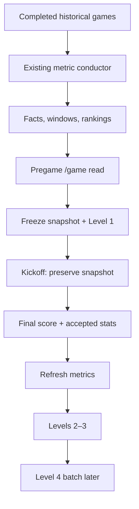

# GameLens Learning Orchestration Product Sprint

**Document status:** Fifth-pass architecture consolidated; implementation not started  
**Created:** 2026-08-06  
**Owner:** GameLens product stewardship  
**Repository:** `csells10/meow`  
**Branch baseline reviewed:** `main` at `d9d261980d0c1ca9dd3994b84a57bfb2b3a1713e`  
**Companion architecture:** [GameLens_Product_Data_Collection_and_Learning_Handoff.md](./GameLens_Product_Data_Collection_and_Learning_Handoff.md)  
**Production release evidence:** [go_plan.md](./go_plan.md)

---

## 1. The decision

GameLens needs one additional **small learning conductor**, but it must not replace or duplicate the production ETL.

The existing production path remains responsible for completed-game data:

```text
Schedule -> Stats -> Scores
                 -> accepted Stats gate
                 -> Facts -> Windowed Metrics -> Rankings
```

The new learning conductor coordinates three deliberately separate entry points:

1. **Before kickoff:** capture and freeze the pregame payload, then store Level 1 claims.
2. **After final data is ready:** run Levels 2 and 3 for games that have both a valid Level 1 capture and completed-game Facts.
3. **After enough evidence accumulates:** run Level 4 as a controlled calibration batch.

This preserves the 2023–2025 feature work without allowing postgame data to leak into a prediction.

The recommended future module name is:

```text
services/gamelens_learning_pipeline_conductor.py
```

The name is provisional until Packet 1 confirms the current interfaces. The architectural boundary is not provisional.

---

## 2. Why the earlier descriptions felt contradictory

Two different jobs were being described with the same word: **features**.

| Meaning | When it exists | What it does |
|---|---|---|
| Runtime pregame feature metadata | Before kickoff | Helps `/game` describe the matchup from pregame-safe metrics and rankings |
| Persisted Level 3 training features | After Level 1 has been captured; currently processed after final with Level 2 | Adds the same type of pregame-safe context to saved claim rows so historical validation and calibration can learn from it |

Level 3 running after final does **not** mean its input may use the final score or the evaluated game's postgame facts. Level 3 is scheduled after Level 2 for a convenient learning workflow, but its feature inputs remain pregame-only.

The live `/game` response already exposes guarded metadata such as `two_way_context_v1` and `offensive_efficiency_support_v1`. That runtime exposure is useful before kickoff, but it is not proof that persisted Levels 1–4 ran.

---

## 3. The two clocks



The first clock produces the prediction and explanation. The second clock evaluates that frozen evidence so future predictions can improve.

### Clock A — before kickoff

1. Use only completed games dated before the target game's kickoff.
2. Read the latest healthy Facts, Windowed Metrics, and Rankings.
3. Build the normal pregame `/game` response.
4. Save one immutable canonical snapshot.
5. Extract and persist Level 1 claims from that snapshot.
6. Freeze the displayed pregame read.

### Clock B — after the game

1. Collect final score and completed box-score/stat data.
2. Run the existing Facts -> Windowed Metrics -> Rankings conductor.
3. Confirm the specific game has accepted postgame Facts.
4. Run Level 2 claim validation.
5. Run Level 3 feature enrichment using only the saved pregame inputs.
6. Refresh `/admin` evidence from the canonical tables.
7. Let Level 4 run later, after a meaningful sample exists.

---

## 4. Frontend lifecycle and Levels 1–4

The Levels are primarily a learning lifecycle, not four frontend data sources. The frontend receives a pregame product read, preserves it, and later reveals outcome/evaluation sections.

| Frontend section | Before kickoff | In progress | After final | Level relationship |
|---|---|---|---|---|
| Game Profile | Show | Preserve unchanged | Preserve unchanged | Runtime `/game` creates it; Level 1 freezes its claims; Level 2 later validates applicable claims; Levels 3–4 analyze future reliability |
| Core Area Advantage | Show | Preserve unchanged | Preserve unchanged | Runtime `/game` creates it; Level 1 freezes it; Level 2 validates; Levels 3–4 segment and calibrate the evidence |
| Matchup Lean | Show | Preserve unchanged | Preserve unchanged | Runtime `/game` creates it; Level 1 freezes it; separate game calibration grades it after final; Level 4 may recommend a future guarded change but does not rewrite this game |
| Team Comparison | Show | Preserve unchanged | Preserve unchanged | Runtime `/game` creates it; Level 1 freezes claim rows; Level 2 validates; Level 3 attaches pregame feature context |
| Pregame Model Read | Show | Preserve unchanged | Preserve unchanged | Pregame capture freezes it; Level 1 extracts its claim evidence; the separate game-outcome path evaluates it after final |
| Live / Final Score | — | Show if available | Show final | Scores ETL; not a Level 1–4 product |
| Model Outcome | — | Do not grade | Show when final score exists | Existing final-score/model-outcome logic; separate from claim validation |
| Claim Validation | — | — | Admin/internal after Facts are ready | Level 2 |
| Claim Feature Health | Optional Admin/debug only | — | Admin/internal | Level 3 |
| Calibration Summary | — | — | Admin after a batch | Level 4 |

### Frontend rule

Once kickoff occurs, never rebuild the pregame cards from newly available postgame evidence. Show the saved pregame snapshot and add new result/evaluation sections beside it.

---

## 5. What each Level actually owns

| Level | Trigger | Reads | Writes | Must never do |
|---|---|---|---|---|
| Level 0 | Setup/migration only | Schema definitions | Claim-training table/schema | Run as a daily job |
| Level 1 | Valid capture before kickoff | Immutable pregame snapshot | One row per saved claim | Read final score, actual winner, final margin, current-game postgame metrics, or replace an entire cumulative cohort |
| Level 2 | Final game plus accepted Facts | Level 1 rows and current game's postgame Facts | Validation result and actual evidence fields | Change the frozen prediction or treat a winner miss as automatic claim failure |
| Level 3 | Successful Level 2-eligible game | Saved pregame fields and registry metadata | Feature scores, buckets, versions, context | Use `validation_result`, final score, actual winner, actual gap, or any other target as a feature input |
| Level 4 | Weekly or evidence threshold | Accumulated validated/enriched claim rows | Calibration summaries and recommendations | Run per game, hide small samples, or automatically steer matchup lean, confidence, Model Trust, or frontend copy |

### May feature work preserved

The following work remains useful and is not discarded:

- `clean_hierarchy_context_v1`;
- `offense_finish_score`;
- `defensive_suppression_score`;
- `two_way_edge_score`;
- `two_way_context`;
- `claim_strength_context_v1`;
- `offensive_efficiency_support_v1`; and
- Core Area durability/calibration research.

These are pregame-safe feature or calibration ingredients. Some are already visible as metadata. None should silently become winner logic.

---

## 6. Component boundaries

### Keep unchanged initially

| Existing component | Responsibility |
|---|---|
| `app.py` | Scheduler HTTP entry point and high-level execution summary |
| `services/gamelens_metric_pipeline_conductor.py` | Facts -> Windowed Metrics -> Rankings |
| `/game` and `services/game_service.py` | Build the product response and final outcome fields |
| `agg/gamelens_training/update_claim_training_validation.py` | Level 2 calculation |
| `agg/gamelens_training/update_claim_training_features.py` | Level 3 calculation |
| `agg/gamelens_training/build_claim_language_calibration.py` | Level 4 analysis/calibration |
| `/admin/gamelens/claim-health` | Read and explain game calibration and claim health |

### Add or adapt in small pieces

| Needed piece | Minimum responsibility |
|---|---|
| Pregame capture service | Select eligible scheduled games, build a read-only pregame response, reject postgame-shaped payloads, save an immutable snapshot/manifest |
| Production-safe Level 1 writer | Extract claims from one approved capture and MERGE by a deterministic game-scoped key |
| Learning conductor | Run pregame, postgame, and batch entry points with explicit gates and truthful summaries |
| Minimal learning ledger | Record stage status, reason, game counts, row counts, errors, and identifiers |
| Focused tests | Prove timing, no-op, retry, partial-failure, and leakage behavior |

### Do not build yet

- a second replacement ingestion framework;
- a real-time event bus;
- a new frontend rules engine;
- an automatic self-modifying model;
- a new Admin summary warehouse when the existing canonical tables can answer the question;
- a per-game Level 4 trigger;
- a full model-training platform; or
- a refactor of unrelated `/game` code.

---

## 7. Identifier and replay contract

| Identifier | Scope | Rule |
|---|---|---|
| `pipeline_run_id` | One Scheduler/manual ETL execution | Operational lineage only |
| `learning_run_id` | Stable season + phase + ruleset cohort | Do not create a new value every day |
| `capture_id` | One immutable canonical pregame snapshot for one game | Deterministic and created only before kickoff |
| `claim_key` | One claim within one capture | Deterministic and safe to MERGE repeatedly |

Recommended cohort separation:

```text
2026_preseason_shadow_<ruleset>
2026_regular_season_<ruleset>
```

Never mix preseason rehearsal rows into the regular-season Admin cohort. Never reuse the historical QA run IDs.

The current Level 1 `--replace-run` behavior is acceptable for bounded historical QA, but it is unsafe for refreshing one game inside a cumulative production cohort. Production Level 1 must use game-scoped MERGE or game-scoped delete/reinsert.

---

## 8. Edge-case contract

Every stage returns one of:

```text
success
no_op
partial_failure
failure
quarantined
skipped
```

Blank data is not automatically an exception. The result depends on what the stage was entitled to expect.

| Situation | Required behavior | Downstream action |
|---|---|---|
| No games scheduled for the date/window | `no_op` with zero counts | Stop cleanly; no writes |
| Games exist but none are inside the capture window | `no_op` | Retry on the next scheduled opportunity |
| Valid pregame `/game` payload has no rankings or few/no claims | Save the truthful snapshot; Level 1 may write zero claims with a reason | Do not manufacture features or claims |
| Upstream API returns an empty list on a valid no-game day | `no_op` | Do not retry as an error storm |
| Upstream API returns blank/malformed data for an expected game | `partial_failure` or `failure` for that game | Preserve other games; record the failed game and reason |
| Capture request is repeated before kickoff | Return the existing canonical capture or identical MERGE result | No duplicate snapshots or claims |
| Capture attempt occurs at/after kickoff | Reject or quarantine | Never reconstruct Level 1 from postgame `/game` |
| Final score exists but Stats/Facts do not | Model Outcome may wait or display score-only state; Levels 2–3 `skipped` | Retry after Stats/Facts become ready |
| Stats/Facts exist but final score is unavailable | Claim validation may proceed only when its fact contract is met; game-result grading waits | Keep the two scorecards separate |
| Some final games succeed and others fail | `partial_failure` with per-game results | Run learning only for ready games |
| Facts builder returns empty after accepted Stats | Metric pipeline `failure` | Do not run Levels 2–3 |
| A Level 2 metric is unavailable | Write `unavailable` with reason | Do not hide or convert it to failed claim |
| Level 3 fails | `failure` for Level 3 | Do not make the game Level 4-eligible |
| Level 4 sample is too small | Produce counts and `insufficient_evidence` | No runtime steering |
| Tie | Game outcome is Push/No Decision; claims still validate independently | Reconcile both scorecards |
| Postponed/cancelled/rescheduled game | Preserve prior manifests and record state change | Do not overwrite a valid snapshot with postgame data |
| Scheduler or Cloud Run retries | Reuse deterministic IDs and keys | Same final rows, no duplicates |
| Timeout/OOM | Record failed stage and leave prior good tables/snapshots intact | Safe retry from the failed boundary |

### Missing capture rule

If no valid pregame snapshot was saved before kickoff, the game is recorded as `capture_missing` and excluded from Levels 1–4 learning. Missing one game is better than contaminating the training evidence.

---

## 9. Product sprint packets

This is one product epic delivered as seven small packets. Each packet gets its own review, tests, evidence, commit, and stop/go decision.

### Packet 0 — Freeze the architecture

**Why this is important:** prevents another reinterpretation while implementation begins.

Work:

- save this document;
- identify the canonical architecture and source references;
- record that no production behavior changed; and
- confirm the latest Gate H evidence before starting Packet 1.

Exit evidence:

- documentation-only `[skip ci]` commit;
- current production ETL remains unchanged; and
- next action is Packet 1 only.

### Packet 1 — Define the pregame capture contract

**Why this is important:** Level 1 is only trustworthy if the system can prove what it knew before kickoff.

Work:

- define the eligible game states and capture window;
- define required snapshot and manifest fields;
- define the postgame-field denylist;
- define read-only behavior so capture cannot save Model Outcome rows;
- define `learning_run_id`, `capture_id`, and `claim_key`; and
- define the one-canonical-capture rule.

Tests first:

- scheduled game before kickoff accepted;
- in-progress/final game rejected;
- exactly-at-kickoff rejected;
- final score/actual winner/model result fields rejected when populated;
- missing ranking context accepted and recorded;
- duplicate call produces the same identity; and
- no game produces a clean no-op.

Exit evidence:

- contract and unit tests pass;
- no BigQuery/GCS production write; and
- no `app.py` change.

### Packet 2 — Shadow pregame capture

**Why this is important:** proves the system can safely preserve real 2026 pregame evidence before claim rows are written.

Work:

- implement the read-only capture service;
- run in dev/shadow mode for one game;
- save payload plus manifest to isolated storage;
- verify timestamps, status, versions, and missing-data reasons; and
- replay the same capture.

Exit evidence:

- one valid immutable pregame snapshot;
- zero postgame fields populated;
- zero model-outcome persistence side effects;
- duplicate replay creates no second canonical capture; and
- `/game` frontend response is unchanged.

### Packet 3 — Production-safe Level 1

**Why this is important:** converts the snapshot into durable claim rows without risking the cumulative cohort.

Work:

- adapt the existing Level 1 extractor to accept one approved capture;
- remove production reliance on whole-run replacement;
- write by deterministic game-scoped keys;
- preserve zero-claim captures as visible evidence; and
- run dry-read -> dry-write -> deliberate dev write.

Exit evidence:

- claim counts reconcile to the capture;
- every row traces to `learning_run_id + capture_id + claim_key`;
- duplicate replay adds zero rows; and
- historical QA behavior remains available separately.

### Packet 4 — Postgame Levels 2–3 conductor

**Why this is important:** turns completed games into learning evidence only after the existing metric path is healthy.

Work:

- select only games with a valid Level 1 capture and accepted Facts;
- run Level 2 then Level 3 in that order;
- produce per-game and total summaries;
- make empty/unavailable results explicit; and
- stop Level 3 when Level 2 has a real stage failure.

Exit evidence:

- final game with complete Facts validates successfully;
- score-only and stats-only cases defer correctly;
- ties remain No Decision at game level;
- unavailable claims reconcile visibly;
- duplicate run changes no row counts; and
- no pregame card or prediction changes.

### Packet 5 — Learning ledger and `/admin` reconciliation

**Why this is important:** future-you needs to know what ran, what skipped, and why without reading Cloud logs line by line.

Work:

- persist one minimal run/stage ledger;
- expose stage status and counts to Admin or its protected service layer;
- reconcile captured games, Level 1 games, claims, Level 2 labels, and Level 3 features; and
- keep game calibration and claim health as separate scorecards.

Exit evidence:

- no-op, partial-failure, failure, and success runs are distinguishable;
- preseason and regular-season cohorts cannot mix;
- daily Admin grain uses the stable cohort instead of daily run IDs; and
- counts reconcile at each grain.

### Packet 6 — Level 4 controlled batch

**Why this is important:** calibration needs enough evidence to avoid reacting to one game or one tiny bucket.

Work:

- run Level 4 weekly or after an approved evidence threshold;
- process one stable `learning_run_id` at a time;
- record row/game counts with every recommendation;
- keep `metadata_only = true` and `language_boost_allowed = false`; and
- test empty, small-sample, and repeat-run behavior.

Exit evidence:

- repeatable summary output;
- small samples are labeled, not promoted;
- no matchup-lean, confidence, Model Trust, or frontend copy changes; and
- `/admin` can explain the evidence.

### Packet 7 — Production wiring, last

**Why this is important:** activation should be the smallest final change after every component is independently proven.

Work:

- wire the pregame entry point to an approved schedule;
- wire postgame Levels 2–3 only after the existing metric readiness gate;
- keep Level 4 on its separate batch schedule;
- add feature flags/kill switches; and
- change `app.py` last.

Exit evidence:

- disabling learning leaves Schedule, Stats, Scores, Facts, Windowed Metrics, Rankings, `/games`, and `/game` untouched;
- first production run is shadow/read-only where possible;
- rollback is disabling the new trigger/flag, not reverting the production ETL; and
- one game is followed through the complete two-clock lifecycle.

---

## 10. Suggested conductor interface

This is a responsibility sketch, not code to copy unchanged.

```python
run_pregame_capture(
    eligible_game_ids,
    learning_run_id,
    write=False,
)

run_postgame_learning(
    ready_game_ids,
    learning_run_id,
    run_level2=True,
    run_level3=True,
    write=False,
)

run_calibration_batch(
    learning_run_id,
    write=False,
)
```

The conductor returns summaries. Workers continue to own football calculations and table writes. `app.py` should only pass identifiers, inspect statuses, and report the combined result.

---

## 11. Testing ladder for every packet

Use the same ladder every time:

1. Read the full affected files.
2. Add or update focused unit tests.
3. Run syntax/import checks.
4. Run the focused test module.
5. Run the relevant combined test suite.
6. Run read-only/dry-run behavior.
7. Review counts and a small sample manually.
8. Perform one deliberate dev write only after the dry run passes.
9. Rerun the same input to prove idempotency.
10. Review `git diff` and stop.
11. Commit one responsibility.
12. Update this document with evidence before starting the next packet.

Production is not the place to discover blank-response or retry behavior. Each packet must include those cases locally/dev first.

---

## 12. Definition of done for the epic

The learning loop is production-ready only when:

- every admitted game has a valid immutable pregame snapshot created before kickoff;
- missing captures are excluded rather than reconstructed;
- the frozen frontend pregame read never changes after kickoff;
- Level 1 is game-scoped and idempotent;
- Levels 2–3 run only for games with accepted postgame Facts;
- Level 3 inputs are proven pregame-only;
- Level 4 runs in controlled batches with visible sample sizes;
- no-op, partial-failure, failure, quarantined, skipped, and success states are visible;
- blank upstream data cannot erase prior good data;
- game calibration and claim health remain separate;
- preseason and regular-season cohorts remain separate;
- `/admin` populations reconcile;
- disabling the learning layer leaves the existing ETL and frontend operational;
- no feature changes runtime confidence or language without a separate release decision; and
- another owner can restart from this document without relying on chat history.

---

## 13. First implementation decision

Do not begin by wiring all Levels into `app.py`.

Begin with **Packet 1: the pregame capture contract and its tests**.

Before Packet 1 code begins, confirm and document the final Gate H automatic-run evidence. The reviewed `main` baseline still describes that observation as pending.

If the first 2026 game reaches kickoff before Packet 2 exists, record it as `capture_missing`. Do not rebuild a fake Level 1 snapshot afterward.

---

## 14. New-chat restart prompt

Use this exact handoff in a fresh chat:

> Continue GameLens from `documentation/live/GameLens_Learning_Orchestration_Product_Sprint.md`. Treat it as the fifth-pass execution plan and `documentation/live/GameLens_Product_Data_Collection_and_Learning_Handoff.md` as the canonical architecture. Confirm current `main` and Gate H evidence first. Start Packet 1 only: define and test the pregame capture contract. Do not change production behavior, do not wire `app.py`, and stop after the Packet 1 evidence and commit.

---

## 15. Sources reviewed

- `documentation/live/GameLens_Product_Data_Collection_and_Learning_Handoff.md`
- `documentation/live/go_plan.md`
- `documentation/August/GameLens_Backend_August_Readiness_Plan.md` as historical planning evidence only
- `documentation/GameLens_Claim_Training_and_Level4_Roadmap.md`
- `documentation/GameLens_Admin_API.md`
- `documentation/Gamelens_Feature_Guide_Book_20260524.md`
- `documentation/Features/*`
- `documentation/stand_up/202605/*` feature and calibration checkpoints
- attached `GameLens_QA_Documentation.md`
- current `main` `app.py`
- current `main` `services/gamelens_metric_pipeline_conductor.py`
- current Level 1–4 worker locations
- supplied `/game`, Model Trust, metric-builder, and claim-validation source references

Four requested source uploads were unavailable during this review and must be reattached before implementation touches them:

- `api_call_nfl_stats.py`
- `api_call_nfl_scores.py`
- `api_call_nfl_games.py`
- `config.py`

Their absence does not change the two-clock architecture. It does mean Packet 1 must confirm their current interfaces from `main` before making any integration decision.
