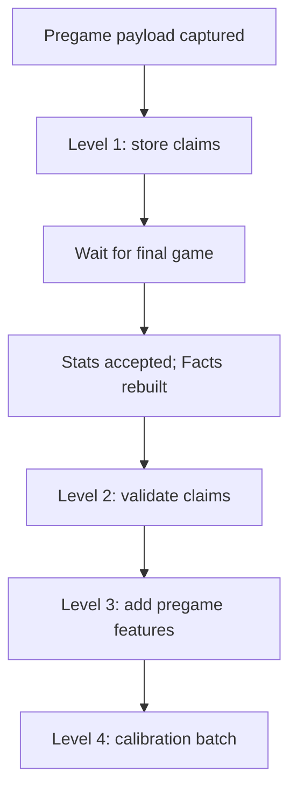

# GameLens Product Data Collection and Learning Handoff

**Document status:** Architecture handoff active; Packets 1–4 and the separate Calibrated Matchup Lean release are complete; Packet 5 planning is next  
**Created:** 2026-08-03  
**Last revised:** 2026-08-18  
**Owner:** Senior Product Manager / GameLens product stewardship  
**Repository:** `csells10/meow`  
**Branch represented:** `dev` for learning work; `main` remains the production release branch  
**Current production checkpoint:** Gate H remains complete; Calibrated Matchup Lean revision `nfl-games-app-main-00155-qaf` serves 100% traffic; the existing 8:00 a.m. production load remains unchanged and learning is not wired into it  
**Companion release plan:** [go_plan.md](./go_plan.md)  
**Live documentation index:** [README.md](./README.md)  
**Dataset recreation runbook:** [GameLens Development Dataset Recreation Runbook](./GameLens_Development_Dataset_Recreation_Runbook.md)  
**Current packet:** Packet 5 planning; create `GameLens_Packet_5_Admin_and_Run_Visibility.md` before implementation

---

## Document authority and stale-document boundary

Use this document as the canonical product and architecture handoff for productionizing the GameLens intelligence layer after the `/game` cutover. Use [go_plan.md](./go_plan.md) for the production release checkpoint and Gate H evidence.

Older files remain useful evidence, but they do not override this handoff:

| Document | Current role |
|---|---|
| `documentation/live/GameLens_Learning_Orchestration_Product_Sprint.md` | Canonical packet sequence, current status, and next-step authority |
| `documentation/live/GameLens_Product_Data_Collection_and_Learning_Handoff.md` | Canonical Levels 1–4 product and architecture boundary |
| `documentation/live/GameLens_Packet_1_Pregame_Capture_Contract.md` | Approved capture rulebook |
| `documentation/live/GameLens_Packet_2_Shadow_Pregame_Snapshot_Plan.md` | Completed snapshot and observability evidence |
| `documentation/live/GameLens_Packet_3_Production_Level_1.md` | Completed Packet 3 Implementation GO evidence and deferred pre-production real-data validation |
| `documentation/live/GameLens_Calibrated_Matchup_Lean_Hotfix.md` | Completed separate confidence release and production receipt |
| `documentation/live/GameLens_Packet_4_Postgame_Learning.md` | Completed Packet 4 Implementation GO evidence and Packet 5 handoff |
| `documentation/live/GameLens_Development_Dataset_Recreation_Runbook.md` | Six-table development schema ownership, recreation order, and Packet 7 production-migration requirement |
| `documentation/live/README.md` | Live-folder reading order and stale-document boundary |
| `documentation/live/go_plan.md` | Historical production cutover and completed Gate H evidence; not the current learning release plan |
| `documentation/Gamelens_Feature_Guide_Book_20260524.md` and `documentation/Features/*` | Feature research, definitions, and guardrails |
| `documentation/August/GameLens_Backend_August_Readiness_Roadmap.md` | Historical implementation record for Packets 0–4 |
| `documentation/August/GameLens_August_Readiness_Roadmap_How_To.md` | Historical restart instructions; do not use its old `dev`/Packet 4 directions |
| `documentation/August/GameLens_Backend_August_Readiness_Plan.md` | Preserved original planning draft; intentionally left untouched |
| `documentation/GameLens_Claim_Training_and_Level4_Roadmap.md` | Detailed technical/research reference; this handoff governs production timing and identifiers |

When wording conflicts, current `dev` code and passing evidence govern the
learning track, current `main` code governs production behavior, `go_plan.md`
governs release receipts, and the Sprint governs packet status and next action.

---

## 1. Executive read

GameLens now has a season-aware, error-walled path that can move newly accepted game data through:

```text
Schedule -> Stats -> Scores
                  |
                  v
        accepted Stats game gate
                  |
                  v
Facts -> Windowed Metrics -> Rankings -> /game
```

This is a major improvement over the previous hard-coded annual trigger. The active season comes from runtime configuration, the builders run in a fixed order, each stage reports its own status and row count, and a failed metric stage prevents the remaining metric stages from being presented as successful.

The next product problem is different:

> How do we collect trustworthy 2026 evidence so GameLens can learn whether its pregame claims held up after each game, and eventually hand that evidence to a future product, data, or engineering owner?

The existing Levels 0–4 system is the foundation for that learning loop, but it is **not currently part of the scheduled production ETL**. This document separates what is already live from what still needs to be designed and proven.

---

## 2. Correct Level 1–4 timing

The idea that “Levels 1–4 should run after successful Scores and Stats ETL” is only partly correct.

**Level 1 must originate from an immutable payload captured before kickoff. Levels 2–4 wait for final Stats and Facts.**



The production Level 1 capture must fail closed:

- require `captured_at < scheduled_kickoff`;
- require a scheduled/non-final game state;
- reject or quarantine any source payload containing populated `final_score`, `actual_winner`, `model_result`, final-margin fields, or other postgame evidence;
- record legitimate missing early-season metrics rather than manufacturing claims; and
- remain read-only with respect to model-result persistence.

The existing Level 1 worker is suitable for historical QA but is not yet the production capture boundary. It reads saved payload files and can accept postgame-shaped fields if the caller supplies them. Production work therefore begins with a new capture contract, not by scheduling the historical worker unchanged.

## 3. Product intent

The learning system should answer:

> When GameLens made a specific pregame matchup claim, did postgame data support that claim?

It should not silently turn into:

- winner prediction;
- betting guidance;
- a matchup-lean override;
- an automatic High Confidence generator;
- a Model Trust override; or
- a frontend copy rewrite without an explicit release decision.

A team may lose while a specific pregame claim still validates. Claim quality and winner accuracy are separate product questions.

### Dual feedback objective

The future learning layer needs two scorecards tied back to the same pregame snapshot:

1. **Game-result calibration:** Did the directional matchup read align with the game result? This uses one game-level record and is not the same as claim validation.
2. **Claim health:** Were the individual football claims supported by completed-game facts? This uses many claim rows per game.

A future algorithm may learn from both objectives, but neither score may silently overwrite the other. User selection/clicks remain product-interest evidence, not football correctness.

---

## 4. Current production data path

### 4.1 Scheduled ingestion

The production application preserves this order:

```text
Schedule -> Stats -> Scores
```

The application then evaluates the number of **successfully accepted Stats games**.

Important meanings:

- Stats success means accepted games, not inserted row count.
- Zero accepted Stats games is a successful, explicit no-op.
- One or more accepted Stats games triggers the season-aware metric conductor with writes enabled.
- Scores are still collected and truthfully reported, but the current metric-pipeline gate is accepted Stats games.
- A partial or failed ingestion stage remains visible in the execution summary.
- A failed metric pipeline is returned as a failure rather than hidden behind HTTP 200.

### 4.2 Metric preparation

The conductor runs a deterministic full season-to-date rebuild in this exact order:

```text
Analytics.game_team_metric_facts_{season}
  -> Analytics.team_metrics_windowed_{season}
  -> Analytics.team_metric_rankings_{season}
```

Each builder validates that it produced a non-empty DataFrame. A failed stage stops the remaining stages. The default write behavior replaces the season-specific output table, which recalculates rolling windows and league rankings consistently after newly completed games.

### 4.3 `/game`

`/game` reads the prepared metric and ranking data and can degrade safely when early-season rankings do not exist.

The current response also computes claim-language metadata such as:

- `two_way_context_v1`;
- `offensive_efficiency_support_v1`;
- row-level `language_support`; and
- claim-strength metadata.

That runtime metadata is **not proof that the persisted Levels 1–4 learning pipeline ran**. The runtime layer currently derives bounded metadata from the available matchup objects and allowlists. Persisted historical calibration remains a separate workflow.

---

## 5. Levels 0–4: current truth

| Level | Purpose | Current implementation | Production automation status |
|---|---|---|---|
| Level 0 | Create or migrate the claim-training table | `create_claim_training_examples_table.py` | Setup-only; not a daily job |
| Level 1 | Extract one row per pregame GameLens claim | Historical CLI plus Packet 3 snapshot adapter/service and game-scoped development MERGE | Implementation GO in development; not connected to production scheduling; first genuine populated cloud write/retry remains a pre-production validation |
| Level 2 | Validate pregame claims against postgame facts | Existing validation calculations plus Packet 4 capture/game-scoped adapter and dev update boundary | Implementation GO in development; zero-claim real cases and populated controlled fixtures proven; not connected to production scheduling |
| Level 3 | Add pregame-safe engineered feature context | Existing feature calculations plus Packet 4 leakage-safe adapter and capture-scoped dev update boundary | Implementation GO in development; 15-field additive migration proven; not connected to production scheduling |
| Level 4 | Aggregate claim-language calibration evidence | `build_claim_language_calibration.py` | Working as an analysis/calibration job; not a production runtime steering job |
| Runtime exposure | Present safe metadata in `/game` | `claim_language_features.py`, `claim_language_response.py`, `game_service.py` | Active metadata layer; guarded and non-steering |

### Current Packet 1–4 development data plane — 2026-08-18

Packets 1–4 now use one six-table development namespace:

```text
GameLens_dev.pregame_snapshots
    -> GameLens_dev.claim_training_examples
    -> Level 2 and Level 3 update the same capture-scoped claim rows

frozen capture + final score
    -> GameLens_dev.game_model_outcomes

Packet 2 operations
    -> GameLens_dev.stage_runs
    -> GameLens_dev.stage_game_results

Packet 4 operations
    -> GameLens_dev.postgame_learning_stage_receipts
```

This separation is intentional:

- snapshots preserve what the product knew before kickoff;
- claims preserve individual statements and their Level 2/3 enrichment;
- outcomes preserve one capture-aware game grade;
- stage tables and Packet 4 receipts explain what ran, skipped, failed, or
  retried; and
- no table is a substitute for Cloud Logging or an excuse to duplicate the
  football calculations.

The code-owned schema functions, field counts, partitions, clustering, setup
order, and structure-versus-data boundary are recorded in the
[development dataset recreation runbook](./GameLens_Development_Dataset_Recreation_Runbook.md).
Current setup scripts are development-only. Packet 7 must provide the reviewed
production migration entry point before activation.

### Current Level 3 and Level 4 guardrails

Preserve these boundaries:

- feature engineering must remain pregame-only;
- Level 3 must not use final score, winner, `validation_result`, `actual_gap`, or other postgame outcomes as feature inputs;
- claim validation rate is not winner accuracy;
- `offensive_efficiency_support_v1` remains metadata-only;
- `metadata_only = true` and `language_boost_allowed = false` remain the safe defaults for that feature;
- claim-language support must not change matchup lean, outcome confidence, Model Trust, or winner logic;
- `core_area_durability_context_v0` remains audit/Admin-only and must not change production confidence labels yet.

### `/admin` feedback-loop contract

The protected endpoint is already registered at:

```text
GET /admin/gamelens/claim-health?run_id=<learning_run_id>&season=2026&grain=<day|week|season_phase>
```

It intentionally contains two families of evidence:

| Admin family | Grain | Question answered |
|---|---|---|
| Game Calibration | One row per game, then grouped | Did the directional read align with the result, and did Low/Medium/High behave credibly? |
| Claim Health | One row per saved claim, then grouped | Which claim types, Core Areas, categories, surfaces, and features were supported by postgame facts? |

The reconciliation contract for each selected `learning_run_id` is:

- immutable captured-game count equals the number of games admitted to Level 1;
- distinct Level 1 `game_id` count equals the captured-game count, except explicitly quarantined captures;
- each claim row traces to exactly one `capture_id` and `claim_key`;
- winner-graded, no-pick, and no-decision game counts sum to the game-level population;
- Level 2 validation-result counts plus explicitly unavailable rows sum to the claim population;
- the confidence distribution saved in the pregame snapshot agrees with the claim-training rows and the corresponding Admin game totals; and
- daily trend points use the stable learning cohort plus `grain=day`, not a new learning run for every day.

Current SQL has an important preseason boundary: coverage, Calibration Over Time, and pillar weekly health exclude schedule rows whose week begins with `Preseason`, while several claim matrices filter only by `run_id`. Therefore preseason rehearsal rows must not share the regular-season learning cohort until every Admin section has an explicit, consistent season-phase filter.

### Identifier and idempotency contract

One identifier must not do every job:

| Identifier | Scope | Purpose |
|---|---|---|
| `pipeline_run_id` | One Scheduler/manual ETL execution | Operational lineage for Schedule, Stats, Scores, Facts, Windowed Metrics, and Rankings |
| `learning_run_id` | Stable season + phase + model/ruleset cohort | Accumulating Levels 1–4 evidence and the value currently passed to `/admin` as `run_id` |
| `capture_id` | One immutable pregame snapshot for one game | Proves exactly what GameLens knew before kickoff |
| `claim_key` | One deterministic claim within a capture | Game-scoped replay safety and Level 2/3 updates |

Recommended first cohorts are separate, stable identities such as a preseason shadow cohort and a 2026 regular-season production cohort. Do not create a new `learning_run_id` every day; `grain=day` supplies the daily Admin series. Do not reuse historical QA run IDs.

Level 1 writes must MERGE on a stable game-scoped key such as `learning_run_id + capture_id + claim_key`, or delete/reinsert only the selected game. The current whole-run replacement behavior must never be used to refresh one game inside a cumulative production cohort.

### Level 4 batching boundary

The current Level 4 worker reads exactly one source `run_id`. For the first production design, it may recalculate the full cumulative regular-season `learning_run_id` at a weekly or evidence threshold. Selecting across multiple learning cohorts or processing only “new rows since last week” requires an explicit future contract or worker change; it is not supported today.

### Approved confidence-calibration rule — not live

The Admin preview provides enough evidence to approve this as a future isolated production change:

```text
Preserve Matchup Lean, target team, Profile Type, winner logic, and Model Trust.
If confidence is High and core_gap < 0.45, soften High to Medium.
Otherwise preserve the existing confidence label.
Never promote Low or Medium through this rule.
```

Implementation belongs beside the existing `/game` confidence guardrails, but only after Gate H and an isolated test/reconciliation step. Persist Admin/audit fields including `confidence_before_calibration`, final `confidence`, `core_gap`, `calibration_rule = core_gap_high_floor_v1`, `calibration_applied`, and the applicable model/ruleset version.

This rule is **approved for isolated implementation but is not currently live**.

---

## 6. Data that must be collected

### 6.1 Pregame snapshot record

For every eligible game, retain enough information to prove what GameLens knew before kickoff:

| Field | Why it matters |
|---|---|
| `game_id`, season, scheduled kickoff | Stable identity and timing |
| payload capture timestamp | Proves the snapshot was pregame |
| game status at capture | Prevents final-game contamination |
| complete `/game`-style payload | Source for Level 1 claim extraction |
| metric/ranking source dates | Shows how fresh the evidence was |
| model, feature, and formula versions | Makes later comparisons reproducible |
| capture status and error | Prevents silent gaps |
| immutable storage location or object identifier | Makes the evidence auditable |

The production collector must be explicitly read-only. It should not rely on final-game `/game` side effects. The current QA collector protects itself by disabling `save_model_results`; a production design should make this separation intentional rather than depend on monkeypatching. Captures that fail the timing/status/postgame-field contract are quarantined with a reason and never admitted to Level 1.

### 6.2 Completed-game ETL record

For each scheduled run, retain:

- execution timestamp and active season;
- selected game IDs;
- Schedule, Stats, and Scores stage statuses;
- accepted Stats game count;
- failed-game counts and failure reasons;
- Facts, Windowed Metrics, and Rankings statuses;
- row counts for all three metric stages;
- failed metric stage, when applicable;
- total runtime;
- Cloud Run revision; and
- explicit success, no-op, partial-failure, or failure outcome.

### 6.3 Claim-learning record

For each learning run, retain:

- attempt ID, overall status, start/finish timestamps, and duration;
- per-game and per-stage status rows;
- `pipeline_run_id`, `learning_run_id`, `capture_id`, `game_id`, and
  `claim_key` where applicable;
- source payload hash, extraction/model/ruleset/formula versions, and
  source/target table identity;
- Level 1 input/output, inserted, unchanged, and conflict counts;
- Level 2 validation counts by result plus unavailable/rejected counts;
- Level 3 formula version and feature bucket counts;
- Level 4 calibration version and recommendation counts;
- BigQuery write mode and dry-run evidence location;
- stable failure reason code, readable message, failed boundary, and retryable
  status;
- non-secret exception class and Cloud Logging execution/trace reference when
  an exception occurs;
- preservation of successful sibling games when one game or stage fails; and
- reviewer decision.

A top-level `failure` or `partial_failure` is not a complete diagnostic. The
operator view must answer: which game, which stage, which input version, what
failed, and what is safe to retry. A true zero must remain visibly zero rather
than being collapsed into missing or failed. `stage_runs` and
`stage_game_results` are the minimum durable pattern; add only the smallest
schema change needed when existing fields cannot answer those questions.

---

## 7. Proposed production lifecycle

The learning lifecycle should use separate pregame and postgame checkpoints.

### Checkpoint A — pregame evidence capture

Run only when:

- the game is scheduled and not final;
- the relevant season metrics/rankings are available or the payload can truthfully record their absence; and
- kickoff has not occurred.

Output:

- immutable payload snapshot with deterministic `capture_id`;
- capture manifest containing `pipeline_run_id`, `learning_run_id`, kickoff, capture time, status, versions, and any quarantine reason;
- explicit rejection of populated postgame evidence;
- no claim validation and no production language change.

### Checkpoint B — Level 1 claim extraction

Run from the immutable pregame snapshot.

Output:

- one row per pregame claim with deterministic `claim_key`;
- game-scoped insert-only MERGE inside a stable `learning_run_id`;
- duplicate rerun produces no additional claims;
- dry-run review before the first BigQuery write.

### Checkpoint C — completed-game data preparation

Run through the current scheduled production path:

```text
Schedule -> Stats -> Scores -> accepted Stats gate
-> Facts -> Windowed Metrics -> Rankings
```

Output:

- truthful ETL summary;
- season-specific postgame facts ready for validation;
- refreshed data for `/game`.

### Checkpoint D — Levels 2 and 3

Run only for games that have both:

- an accepted pregame Level 1 claim set; and
- completed-game facts.

Output:

- Level 2 validation labels;
- Level 3 pregame-safe feature metadata;
- no automatic runtime copy or confidence changes.

### Checkpoint E — Level 4 calibration

Run as a controlled batch after enough newly validated claims exist. It does not need to run after every individual game.

Output:

- calibration summary rows;
- sample sizes and validation rates;
- language action recommendations;
- explicit metadata-only or promotion decision.

**Product recommendation:** begin with a weekly or evidence-threshold batch over one stable regular-season `learning_run_id`, not a per-game Level 4 trigger. Calibration needs enough rows to avoid reacting to tiny samples. The current worker cannot combine multiple run IDs, so a multi-cohort batch is deferred until its selection contract is designed.

---

## 8. Phased delivery plan

| Phase | Goal | Exit evidence | Product effect |
|---|---|---|---|
| P0 | Complete Gate H | First scheduled production ETL has truthful stage evidence | Confirms the new metric path in production |
| P1 | Define pregame capture contract | Timing, storage, idempotency, and read-only behavior approved | No user-facing change |
| P2 | Shadow-capture 2026 pregame payloads | Captures are pre-kickoff, complete, and reproducible | No learning writes yet |
| P3 | Prove Level 1 on 2026 shadow data | Dry-run counts reviewed; duplicate run is safe | Claim rows become available |
| P4 | Prove Level 2 after completed games | Postgame facts match the saved claims; unavailable rows explained | Validation evidence becomes available |
| P5 | Prove Level 3 and Level 4 in shadow mode | Feature and calibration summaries pass guardrails | No runtime steering |
| P6 | Handoff and adoption decision | Evidence packet, rollback boundary, and owner sign-off complete | Separate decision for Admin/frontend use |

Do not start P1 operational work until Gate H closes the current production cutover.

### August 6 preseason decision

The August 6 game does **not** require Levels 1–4 for `/game` or the production ETL to work. If Gate H is complete and no production code is changed, it may be used for one optional read-only shadow capture before kickoff. That capture belongs to a separate preseason shadow `learning_run_id`; it may truthfully contain few or no claims because early-season rankings are absent. Levels 2–3 may be rehearsed only after final Facts exist, and Level 4 waits for a meaningful sample. The regular-season Admin accuracy series remains separate.

---

## 9. Acceptance criteria

The first 2026 learning-loop pilot is successful when:

- every included game has exactly one approved immutable pregame snapshot;
- every snapshot timestamp is before kickoff;
- no final score or postgame metric leaks into Level 1 or Level 3 inputs;
- accepted Stats games trigger the correct season-specific metric tables;
- failures and no-ops are distinguishable;
- the three metric stages report credible row counts;
- `lens_tags` remains a repeated string in BigQuery and an array in `/game`;
- Level 1 can be rerun without uncontrolled duplicate claims;
- every admitted claim traces through `learning_run_id + capture_id + claim_key`;
- the Admin game population, captured-game population, and claim population reconcile according to the documented grains;
- preseason shadow evidence is isolated from the regular-season Admin cohort;
- Level 2 explains unavailable validations rather than hiding them;
- Level 3 records its formula version;
- Level 4 records sample sizes with every recommendation;
- metadata-only features remain non-steering;
- no learning step changes matchup lean, winner logic, Model Trust, or production copy without a separate release gate; and
- another owner can reproduce the run from the handoff evidence.

---

## 10. Senior Product Manager evidence log

Add one row after each meaningful checkpoint.

| Date | Season / games | Checkpoint | Result | Evidence | Risk or gap | Decision | Next owner/action |
|---|---|---|---|---|---|---|---|
| 2026-08-03 | 2026 | Gate G promotion | Passed | See `go_plan.md` Gate G | First scheduled production ETL not yet observed | Hold at Gate H | Observe Aug. 4 scheduled run |
| TBD | TBD | Pregame capture contract | Pending | — | Timing/storage not selected | — | — |
| TBD | TBD | Level 1 pilot | Pending | — | Production payload source not wired | — | — |
| TBD | TBD | Level 2 pilot | Pending | — | Requires completed facts | — | — |
| TBD | TBD | Levels 3–4 shadow run | Pending | — | Requires reviewed sample size | — | — |

For each update, record evidence rather than only changing a status label.

---

## 11. Decisions made in Draft v0.2

- Level 1 is pregame capture/extraction; it is not a postgame job.
- The learning system keeps separate game-result and claim-health scorecards.
- Daily Admin trends use `grain=day` over a stable `learning_run_id`.
- Preseason shadow evidence uses a different learning cohort from regular season.
- Production Level 1 uses game-scoped idempotency, never whole-cohort replacement.
- The `core_gap_high_floor_v1` High-to-Medium rule is approved for isolated implementation but is not live.
- August 6 is an optional shadow rehearsal, not an intelligence-layer deadline.

## 12. Open product decisions

These remain unresolved in Draft v0.2:

1. **Pregame capture timing:** how long before kickoff should the canonical snapshot be taken, and what happens when rankings are not yet available?
2. **Immutable storage:** where should production pregame payloads and manifests live?
3. **First regular-season cohort name and version contract:** what exact stable `learning_run_id` and ruleset identifier will be used?
4. **Scope after the August 6 rehearsal:** every eligible 2026 game or a bounded regular-season pilot?
5. **Level 4 threshold:** weekly, completed-week, or a minimum number of newly validated claims within the stable cohort?
6. **Admin consistency:** extend season-phase filtering to every section, or keep cohorts permanently separated by phase?
7. **Runtime adoption:** what additional validation is required before the approved confidence rule or a metadata-only feature affects `/game`?

Draft v0.2 makes no additional production-code decision on these questions.

---

## 13. Known feature evidence to preserve

The current feature work supports these product conclusions:

- `two_way_context = supportive` is a repeatable claim-support signal, not a winner signal.
- `offensive_efficiency_support_v1` found above-baseline claim-validation pockets and correctly isolated caution-only metrics.
- `points_per_play` is the current offensive-efficiency anchor.
- `td_rate`, `red_zone_efficiency`, and `turnover_margin_per_game` remain volatile/caution-only for automatic stronger language.
- `third_down_pct` and `1st_down_rate` remain context-only in the offensive-efficiency feature.
- broad Scoring Efficiency must not be treated as uniformly trustworthy.
- Core Area durability produced a useful Admin-only preview. Its `core_gap < 0.45` High-to-Medium rule is approved for isolated implementation, but production `/game` remains unchanged until that separate release step passes.

These are evidence-backed boundaries, not permanent football laws. New 2026 data should test whether they continue to hold.

---

## 14. Handoff packet contents

A future handoff should include:

1. This living product document.
2. The latest production cutover evidence from `go_plan.md`.
3. The pregame capture manifest.
4. The scheduled ETL execution summary.
5. Level 1–4 run IDs and local/BigQuery output locations.
6. Data-quality exceptions and unresolved game IDs.
7. Feature and formula versions.
8. Guardrail verification.
9. Decisions made and decisions intentionally deferred.
10. Dataset schema/migration receipt and the reviewed
    [recreation runbook](./GameLens_Development_Dataset_Recreation_Runbook.md).
11. The exact next bounded action.

The handoff should let a new owner answer four questions quickly:

- What ran?
- What data changed?
- What evidence passed or failed?
- What is the next safe decision?

---

## 15. Source references

### Product and feature definition

- [GameLens Feature Guide Book](../Gamelens_Feature_Guide_Book_20260524.md)
- [Offensive Efficiency Support](../Features/Feature_Offensive_Efficiency_Support.md)
- [Two-Way Context](../Features/Feature_two_way_context.md)
- [Runtime Claim Language Support](../Features/Feature_two_way_Runtime%20Claim%20Language%20Support%20Integration.md)
- [Claim-Strength Metadata](../Features/Feature_Claim_Strength_Metadata.md)
- [Core Area Durability Context](../Features/Feature_Core_Area_Durability_Context.md)
- [Claim Training and Level 4 Roadmap](../GameLens_Claim_Training_and_Level4_Roadmap.md)

### Current production and implementation

- [Controlled Production Cutover Plan](./go_plan.md)
- `../../app.py`
- `../../services/gamelens_metric_pipeline_conductor.py`
- `../../agg/build_metric_facts.py`
- `../../agg/build_windowed_metrics.py`
- `../../agg/build_metric_rankings.py`
- `../../qa_collect_gamelens_payloads.py`
- `../../agg/gamelens_training/build_claim_training_examples.py`
- `../../agg/gamelens_training/update_claim_training_validation.py`
- `../../agg/gamelens_training/update_claim_training_features.py`
- `../../agg/gamelens_training/build_claim_language_calibration.py`
- `../../routes/admin_claim_health_routes.py`
- `../../services/admin_claim_health_service.py`
- `../../queries/admin_claim_health_queries.py`

---

## 16. Next bounded action

Gate H and Packets 1–4 are complete. Packet 3 has Implementation GO; its first
genuine populated-capture write/retry and claim-bearing bounded slate remain
pre-production validations because all seven available preseason captures
contained zero claims.

The next bounded action is Packet 5 planning:

> Create and review `GameLens_Packet_5_Admin_and_Run_Visibility.md`. Inspect the
> protected Admin route/service/queries and reconcile them against the six
> existing `GameLens_dev` tables, their identities, grains, statuses, and
> retention needs before proposing any new storage.

Packet 5 must keep game calibration and claim health separate, preserve the
existing calculation owners and capture lineage, and explain no-op,
partial-failure, failure, and success without requiring line-by-line log
reading. It must not wire `app.py`, write production learning rows, change
`/game`, change the frontend, manufacture claims, or create a duplicate Admin
warehouse without a proven gap. Read the dataset recreation runbook and
runtime guide as part of the inventory; production schema migration remains a
Packet 7 release gate.
